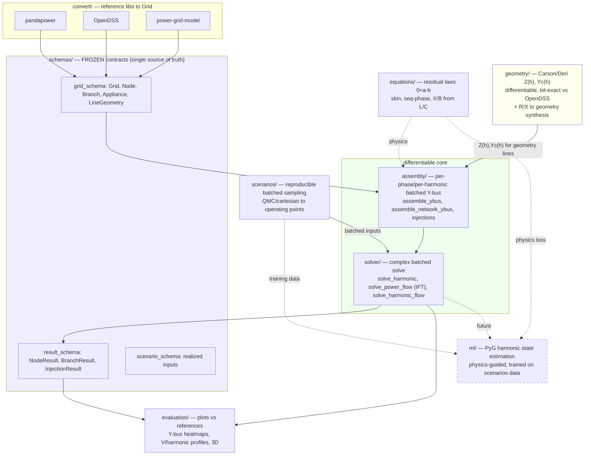

# pgml — session handoff & architecture overview

For human reviewers and the next agents. Quick intro to the library, the architecture
(with diagram), current status, and how/where to pick up the open work. Companion docs:
`CONTEXT.md` (agent navigation index), `TODO.md` (detailed tasks),
`references/ARCHITECTURE.md` (big-picture rationale).

## What this library is
A single **PyTorch** library that (1) generates/loads power grids, (2) simulates
**harmonic power quality in steady state** (harmonic power flow), and (3) supports
**ML on the simulated data** (graph-based state estimation). The defining requirement is
**end-to-end differentiability + GPU readiness**: gradients flow from grid parameters
(down to line geometry) through Y-bus assembly and the complex solve to the outputs, so
the same code is a forward simulator, a differentiable physics engine for ML, and an
inverse/parameter-recovery tool.

Why all-PyTorch: harmonic power flow decouples per harmonic into a LINEAR complex solve
`Y(h)·V(h)=I(h)`, whose adjoint is cheap — so end-to-end gradients flow without
differentiating Newton iterations. PyTorch gives complex tensors, batched solves, GPU,
and native PyTorch-Geometric integration for the ML layer.

## Architecture

**Data flow in one sentence:** a `Grid` (physical params, possibly tensors) → `assembly`
builds complex `Y(f)` per harmonic (lines via explicit R/L/C or via the `geometry` Carson
path) → `solver` solves `Y(f)V(f)=I(f)` (linear) or a nonlinear const-P/ZIP fixed point
with implicit-function-theorem gradients → phasor `results`; `scenarios` batches the
inputs for bulk/training-data generation; `evaluation` compares against
pandapower/OpenDSS.

## Two hard constraints (do not violate)
1. **Differentiable** — gradients `params → Y → solve → outputs`; no
   `.item()/.detach()/.numpy()`/in-place-on-tape/python-branch-on-tensor in core.
2. **GPU-ready** — CPU/CUDA unchanged, honor device/dtype, complex dtypes, batched.
Gate: float64 `gradcheck` + GPU device/dtype tests must pass.

## Current status (2026-06-18) — what's done & validated
- **Load flow**: linear (const-Z) + nonlinear (const-P / full ZIP) via current-injection
  fixed point with IFT gradients. Validated vs pandapower & OpenDSS Y-bus and vs
  pandapower voltages on IEEE-33 and CIGRE LV.
- **Harmonic flow** (`solve_harmonic_flow`): nonlinear fundamental + linear per-harmonic;
  OpenDSS-exact spectrum injection convention.
- **Geometry → impedance** (`pgml.geometry`): differentiable Carson/Deri (earth return +
  skin + Maxwell capacitance), **bit-exact vs OpenDSS** (relZ ~1e-13); R/X→geometry
  synthesis with provenance. OpenDSS-vs-pgml harmonic comparison on IEEE-33 + CIGRE LV
  (Y(h) and voltages match <1e-6 on the same geometry).
- **Positive-sequence harmonic line model** (`pgml.geometry.sequence`): for R/X-defined
  feeders, `X(h)=X1·h` + skin-effect on `R1` with **no earth floor** (the earth term
  cancels in the positive sequence; it lives only in `Z0`, validated via a Fortescue
  decomposition of a 3-phase geometry). Fixes the non-physical-GMR caveat below; applied
  with `apply_positive_sequence_harmonic_model(grid)`. Decision record:
  `references/positive_sequence_harmonic_line_model.md`.
- **Scenarios** (`pgml.scenarios`): reproducible QMC/cartesian batched sampling
  (increment 1); `batched == loop-of-individual`, differentiable through the batch.
- **Evaluation** (`pgml.evaluation`): paper-ready + interactive comparison plots.
- Tests: **165 passing, 9 GPU-skipped**; `ruff` clean. Demos in `examples/`.

**Resolved (was TODO #1):** the single-conductor R/X→geometry synthesis is non-physical
for low-X / cable feeders (GMR floor) — it remains a Carson-code validation vehicle (and
still matches OpenDSS on the same geometry, flagged by a warning). For physically
representative harmonic magnitudes on R/X feeders, use the **positive-sequence harmonic
model** (`apply_positive_sequence_harmonic_model`): no earth floor, GMR never enters. See
`references/positive_sequence_harmonic_line_model.md`.

## How to run
- `pixi run -e cpu pytest -q` — full suite. `pixi run -e cpu ruff check src tests`.
- `pixi run -e cpu python examples/evaluate_ieee33.py` — load-flow eval figures.
- `pixi run -e cpu python examples/evaluate_harmonics_carson.py` — Carson harmonic eval
  (IEEE-33 + CIGRE LV, OpenDSS vs pgml).
- `pixi run -e cpu python examples/evaluate_line_sequence_harmonics.py` — positive-sequence
  harmonic line model: seq R/X vs h, the GMR floor, corrected-vs-naive-vs-OpenDSS feeder.

## Where to start for the open work (full detail in TODO.md)
- **Production batching / GPU data gen (TODO #1)** → `scenarios/` (+ read
  `scenarios/ROADMAP.md` for the deferred design forks), new persistence module,
  `tests/gpu`, `tests/scenarios`.
- **PyG harmonic state estimation (TODO #2)** → new `src/pgml/ml/`; build on
  `equations` (physics loss), `assembly`+`solver` (differentiable forward model),
  `scenarios` (training data), `result_schema` (measurement model),
  `evaluation/topology` (graph). Maintainer will brief the SE method.
- **Load-convergence diagnostics (TODO #3)** → `solver/power_flow.py` (no silent
  fallback; rich diagnostics; gradient/homotopy continuation).
- **Harmonic load/transformer frequency models (TODO #4)** → `solver/harmonic_flow.py`,
  schema `HarmonicShuntModel`; document the chosen current-source model + why.

## Conventions a new agent must respect
- `schemas/` is FROZEN (orchestrator-only); everything imports and conforms to it.
- Each module's `CONTEXT.md` is the interface ledger — read it before editing, update it
  after adding/changing a public signature.
- Float/tensor duality: schema physical fields accept floats OR tensors (autograd).
- Per-frequency, phase-domain, SI, store L/C not X/B; phasors as (real, imag).
