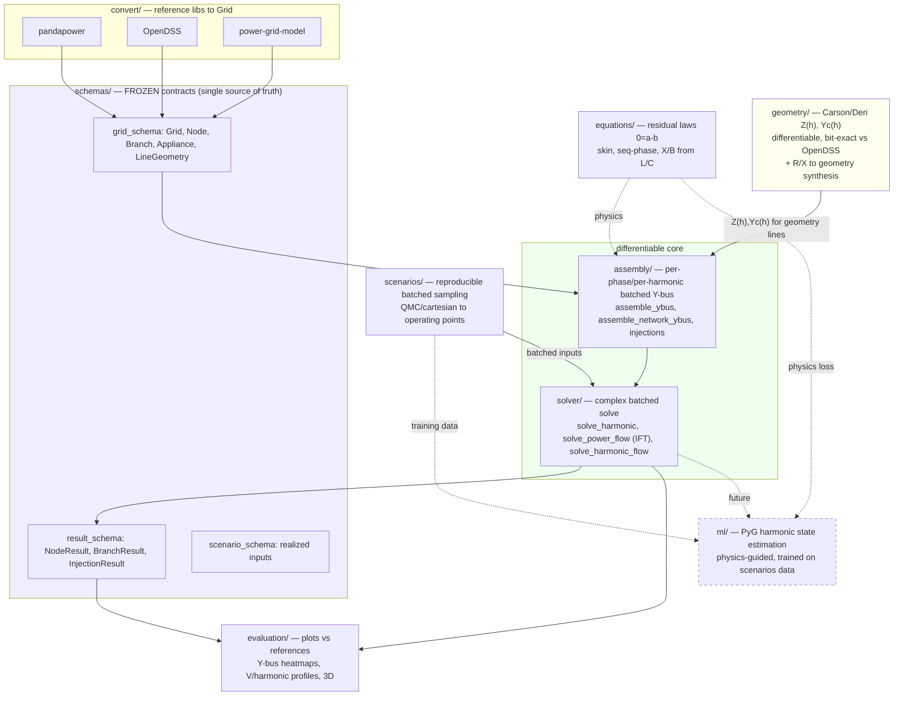

# pgml — session handoff & architecture overview

For human reviewers and the next agents. Quick intro to the library, the architecture
(with diagram), current status, and how/where to pick up the open work. Companion docs:
`CONTEXT.md` (agent navigation index), `TODO.md` (detailed tasks),
`references/ARCHITECTURE.md` (big-picture rationale).

## What this library is
A single **PyTorch** library that (1) generates/loads power grids, (2) simulates
**harmonic power quality in steady state** (harmonic power flow), and (3) supports
**ML on the simulated data** (graph-based state estimation). The defining requirement is
**end-to-end differentiability + GPU readiness**: gradients flow from grid parameters
(down to line geometry) through Y-bus assembly and the complex solve to the outputs, so
the same code is a forward simulator, a differentiable physics engine for ML, and an
inverse/parameter-recovery tool.

Why all-PyTorch: harmonic power flow decouples per harmonic into a LINEAR complex solve
`Y(h)·V(h)=I(h)`, whose adjoint is cheap — so end-to-end gradients flow without
differentiating Newton iterations. PyTorch gives complex tensors, batched solves, GPU,
and native PyTorch-Geometric integration for the ML layer.

## Architecture

**Data flow in one sentence:** a `Grid` (physical params, possibly tensors) → `assembly`
builds complex `Y(f)` per harmonic (lines via explicit R/L/C or via the `geometry` Carson
path) → `solver` solves `Y(f)V(f)=I(f)` (linear) or a nonlinear const-P/ZIP fixed point
with implicit-function-theorem gradients → phasor `results`; `scenarios` batches the
inputs for bulk/training-data generation; `evaluation` compares against
pandapower/OpenDSS.

## Two hard constraints (do not violate)
1. **Differentiable** — gradients `params → Y → solve → outputs`; no
   `.item()/.detach()/.numpy()`/in-place-on-tape/python-branch-on-tensor in core.
2. **GPU-ready** — CPU/CUDA unchanged, honor device/dtype, complex dtypes, batched.
Gate: float64 `gradcheck` + GPU device/dtype tests must pass.

## Current status (2026-06-22) — what's done & validated
- **Public API** (the front door — `pgml.simulate`): `simulate(grid, config) -> SolvedState`
  (differentiable; eager voltages + lazy branch currents/flows/spectra/THD),
  `simulate_serializable(...) -> ResultBundle` (JSON for REST/dashboard/persistence),
  `SimulationConfig` (serializable "what"; device/dtype are execution kwargs). Exception
  hierarchy `pgml.errors` (`PgmError`→`InputError`/`ComputationError`, REST `http_status`),
  raised consistently. See `docs/public-api.md`.
- **Load flow**: linear (const-Z) + nonlinear (const-P / full ZIP) via current-injection
  fixed point with IFT gradients. Validated vs pandapower & OpenDSS Y-bus and vs
  pandapower voltages on IEEE-33 and CIGRE LV.
- **Harmonic flow** (`solve_harmonic_flow`): nonlinear fundamental + linear per-harmonic;
  OpenDSS-exact spectrum injection convention. `assembly.branch_currents` derives per-branch
  terminal currents (KCL-exact) from the solved voltages.
- **Transformer vector groups** (`assembly/_transformer.py`): phase-domain winding-incidence
  primitive `Y = Nᵀ Y_winding N`; a Dyn delta winding correctly traps the zero sequence
  (fixes triplen-harmonic propagation). Nominal ratio + clock shift from `u_rated` +
  connections (`tap` = off-nominal only); default group config `transformer.vector_group`
  (Dyn11). Decision record: `references/opendss/transformer.md`.
- **Geometry → impedance** (`pgml.geometry`): differentiable Carson/Deri (earth return +
  skin + Maxwell capacitance), **bit-exact vs OpenDSS** (relZ ~1e-13); R/X→geometry
  synthesis with provenance — single-conductor (1-phase) AND equilateral 3-conductor
  (3-phase, reproduces Z1+X0). Feeding the same geometry to both engines makes the 3-phase
  harmonic comparison bit-exact on every order incl. triplen (vs a live OpenDSS Dyn
  transformer).
- **Positive-sequence harmonic line model** (`pgml.geometry.sequence`): for R/X-defined
  feeders, `X(h)=X1·h` + skin-effect on `R1` with **no earth floor** (the earth term
  cancels in the positive sequence; it lives only in `Z0`, validated via a Fortescue
  decomposition of a 3-phase geometry). Fixes the non-physical-GMR caveat below; applied
  with `apply_positive_sequence_harmonic_model(grid)`. Decision record:
  `references/positive_sequence_harmonic_line_model.md`.
- **Scenarios** (`pgml.scenarios`): reproducible QMC/cartesian batched sampling, correlated /
  per-phase-symmetry sampling, EN50160 harmonic-spectrum sampling, per-node
  perturbation/injection sweeps, and parquet persistence; `batched == loop`, differentiable.
- **Evaluation** (`pgml.evaluation`): paper-ready + interactive comparison plots. The
  reference oracles (numpy / pandapower / live-OpenDSS) live in the OPTIONAL subpackage
  `pgml.evaluation.oracles` (`oracles` extra); importing `pgml.evaluation` needs no
  pandapower/opendssdirect.
- **Packaging / CI / infra**: `pyproject.toml` (PEP 621, `py.typed`, optional extras),
  GitHub Actions (`ruff` + tests + strict docs), root `conftest` + pytest markers
  (`gpu`/`opendss`/`slow`).
- Tests: **447 passing, 29 GPU/opendss-skipped**; `ruff` + strict docs build clean.
  Demos in `examples/`.

**Resolved (was TODO #1):** the single-conductor R/X→geometry synthesis is non-physical
for low-X / cable feeders (GMR floor) — it remains a Carson-code validation vehicle (and
still matches OpenDSS on the same geometry, flagged by a warning). For physically
representative harmonic magnitudes on R/X feeders, use the **positive-sequence harmonic
model** (`apply_positive_sequence_harmonic_model`): no earth floor, GMR never enters. See
`references/positive_sequence_harmonic_line_model.md`.

## How to run
- **Use the library**: `import pgml; pgml.simulate(grid, pgml.SimulationConfig(...))` — see
  the README quickstart and `docs/public-api.md` (entry-point table: `simulate` vs
  `solver.*` vs `scenarios.run_scenarios`).
- `pixi run -e cpu pytest -q` — full suite. `pixi run -e cpu ruff check src tests`.
- `pixi run -e cpu python examples/evaluate_ieee33.py` — load-flow eval figures.
- `pixi run -e cpu python examples/evaluate_harmonics_carson.py` — Carson harmonic eval
  (IEEE-33 + CIGRE LV, OpenDSS vs pgml).
- `pixi run -e cpu python examples/evaluate_line_sequence_harmonics.py` — positive-sequence
  harmonic line model: seq R/X vs h, the GMR floor, corrected-vs-naive-vs-OpenDSS feeder.

## Where to start for the open work (full detail in TODO.md)
- **Scale / batching to production GPU data-gen (TODO #1)** → `scenarios/` is feature-complete
  for sampling/persistence; the open forks are topology/switch-state batching, multi-grid
  batching, and the SPARSE/chunked batched solve for large N × many scenarios (the main
  scale gap). Read `scenarios/ROADMAP.md`.
- **PyG harmonic state estimation (TODO #2)** → new `src/pgml/ml/`; build on `equations`
  (physics loss), `pgml.simulate`/`assembly`+`solver` (differentiable forward model + the
  `SolvedState` accessors), `scenarios` (training data), `result_schema` (measurement model),
  `evaluation/topology` (graph). Maintainer will brief the SE method.
- **Load-convergence diagnostics (TODO #3)** → `solver/power_flow.py`: `simulate` already
  RAISES `ConvergenceError`; add the rich per-node diagnostics + homotopy continuation.
- **Harmonic load shunt + transformer frequency curves (TODO #4)** → `solver/harmonic_flow.py`,
  schema `HarmonicShuntModel` (the vector-group transformer is already done).

## Conventions a new agent must respect
- `schemas/` is FROZEN (orchestrator-only); everything imports and conforms to it.
- Each module's `CONTEXT.md` is the interface ledger — read it before editing, update it
  after adding/changing a public signature.
- Float/tensor duality: schema physical fields accept floats OR tensors (autograd).
- Per-frequency, phase-domain, SI, store L/C not X/B; phasors as (real, imag).
