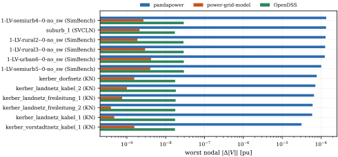

# pgml

**Differentiable power flow and harmonics for electrical grids, on CPU and GPU.**

`pgml` combines phase-domain grid modeling with PyTorch autograd. Simulate unbalanced
networks, generate batches of operating scenarios, and differentiate voltages, currents
and powers with respect to continuous grid parameters. Use those gradients to fit a
**digital twin**, optimize an operating decision, or compute sensitivities.

## Capabilities at a glance

- **Fast GPU simulations:** batch thousands of grid scenarios on CPU or GPU.
- **PyTorch integration:** differentiate simulation outputs to fit grid parameters
  or train models with a physics-based loss.
- **Fundamental and harmonic power flow:** simulate unbalanced grids at harmonic orders.

| Library | Autodiff through power flow | GPU power flow | Harmonics | Unbalanced three-phase |
|---|:---:|:---:|:---:|:---:|
| [**pgml**](https://github.com/power-grid-ml/pgml) | Yes | Yes | Yes | Yes |
| [DPF](https://github.com/Helmholtz-AI-Energy/differentiable-power-flow) | Yes | Yes | — | — |
| [SABLE (paper)](https://arxiv.org/abs/2606.07099) | Yes | Yes | — | — |
| [pandapower](https://github.com/e2nIEE/pandapower) | — | — | — | Yes |
| [PyPSA](https://github.com/PyPSA/PyPSA) | — | — | — | — |
| [power-grid-model](https://github.com/PowerGridModel/power-grid-model) | — | — | — | Yes |
| OpenDSS | — | — | Yes | Yes |

Autodiff means simulation outputs can participate in a general-purpose automatic
differentiation graph. The table describes power-flow capabilities, rather than the
backends available to a separate optimization problem. SABLE's row describes its paper.
Each library has its own supported devices, assumptions and applications.

## Performance: solve scenarios in batches


pgml solves many operating points of one grid in a single batched call, so its
throughput keeps growing with the batch size. Tools that solve one scenario at a
time level off early. On one GPU pgml overtakes every CPU tool at 4,096 scenarios
per batch. For a few scenarios a dedicated CPU solver such as power-grid-model
is faster.

All tools solve identical load scenarios in double precision. A point is shown
only if every scenario converged and matches pgml within 1e-6 pu in voltage
magnitude. The plot covers the forward power flow, without gradients.
[PERFORMANCE.md](assets/PERFORMANCE.md) explains the setup of each tool, what is
timed, and how throughput changes with grid size.

<sub>Measured 2026-09-18, with one NVIDIA L40S 48 GB and eight logical CPUs (four cores) of an AMD EPYC 9334. pgml 0.5.1 (afb5ba6), torch 2.13.0, pandapower 3.5.4 with numba 0.67.0, power-grid-model 1.13.172, OpenDSSDirect.py 0.9.4. complex128, median of five warm repetitions (three for pandapower and OpenDSS).</sub>

## Conformance: understand the differences



The evaluation covers **2,384 grids**. This plot shows the twelve largest
worst-node voltage-magnitude differences among valid comparisons against
pandapower, power-grid-model and OpenDSS. Failed or unsupported reference solves
are excluded from accuracy statistics.

The largest pandapower difference is **1.36e-4 pu**. Controlled comparisons trace
these cases to transformer magnetizing equivalents: pgml and power-grid-model use
a pi equivalent, while pandapower defaults to a T equivalent. On the worst case,
selecting pandapower's pi model reduces the difference to **1.93e-11 pu**.
The reference engines therefore also disagree with one another when their models
differ. Matching the physical assumptions is part of a fair solver comparison.

## Accurate digital twin building

**Goal: recover line resistances from noisy measurements at 48% of buses using
Levenberg–Marquardt optimization and pgml's automatically differentiated measurement
Jacobian.**


This simulated IEEE 33-bus example jointly estimates **20 unknown parameters**:
resistance and reactance on ten trunk lines. It uses **12 operating snapshots**,
voltage magnitudes at **16 of 33 buses**, and four current measurement locations.
The initial catalogue differs from the installed values by up to **43% in resistance**
and **25% in reactance** in this realization. Topology and load injections are known.

Independent Gaussian measurement noise has standard deviations of **0.1% for
fundamental voltage**, **1% for current**, and **5% for harmonic voltage**, relative
to each measured magnitude. The last measurement set adds orders **5, 7, 11 and 13**.
The fit uses a Gaussian catalogue prior with 50% standard deviation. Points show
mean estimates and bars show one standard deviation across four noise draws.

Adding harmonic measurements reduces the recorded median absolute resistance-scale
error from **7.8% to 5.4% of catalogue resistance**, and reactance-scale error from
**12.9% to 2.8%**. Some lines remain weakly identifiable: recovering both resistance
and reactance from partial, magnitude-only measurements is an inverse problem,
and additional measurements improve different parameters by different amounts.

The plotted data and their source hashes are in [assets/readme](assets/readme).

## Install from GitHub

Requires **Python 3.13**. The distribution is `power-grid-ml`; the import is `pgml`.

```bash
pip install "power-grid-ml @ git+https://github.com/power-grid-ml/pgml.git"
```

For the included pandapower-based example and reference-grid conversion:

```bash
pip install "power-grid-ml[convert] @ git+https://github.com/power-grid-ml/pgml.git"
```

Optional extras: `convert` (pandapower/power-grid-model imports), `opendss` (OpenDSS),
`scenarios` (Parquet datasets), and `viz` (plotting).

## A first result, and its gradient

```python
import torch
import pgml
from pgml.grids import ieee33_geometry_grid
from pgml.schemas import Phase

grid, _ = ieee33_geometry_grid()               # IEEE 33-bus feeder with converter loads
load = next(a for a in grid.appliances if a.id == 83)
p = torch.tensor(float(load.p_nom_w), dtype=torch.float64, requires_grad=True)
load.p_nom_w = p                               # a grid parameter that carries gradients

state = pgml.simulate(grid)                    # harmonic power flow, orders 1, 3, ... 13
v = state.voltage(node_id=18, phase=Phase.A)   # complex phasor per order [V]
print(f"fundamental   {v.abs()[0]:8.1f} V")
print(f"5th harmonic  {v.abs()[2]:8.1f} V")
print(f"voltage THD   {state.thd(node_id=18, phase=Phase.A):8.2%}")

v.abs()[2].backward()                          # one backward pass
print(f"d|V5|/dP      {1e3 * p.grad:8.3f} V per kW of converter load")
```

The selected load power is an ordinary autograd leaf. The same approach can fit
continuous physical parameters or propagate a task loss through the solved grid.

## Entry points

| Task | Entry point |
|---|---|
| Full differentiable state | `pgml.simulate(grid, config)` |
| Serializable result | `pgml.simulate_serializable(...)` |
| Direct solver tensors | `pgml.solver.solve_power_flow`, `solve_harmonic_flow` |
| Reproducible scenario batches | `pgml.scenarios.run_scenarios`, `write_dataset` |

`SimulationConfig` describes the study; `device` and `dtype` select execution.
Non-integer harmonic orders are outside the solver's scope. Explicit modeling
presets align supported reference conventions; they do not imply complete
feature equivalence between engines.

## Development and license

Development environments use [pixi](https://pixi.sh). Run the CPU suite with
`pixi run -e cpu pytest -q`. The figure renderer is
`pixi run -e cpu python run/readme/render.py`; it uses recorded data and runs no solves.

If you use pgml in research, see [CITATION.cff](CITATION.cff).
Licensed under the [Mozilla Public License 2.0](LICENSE).
