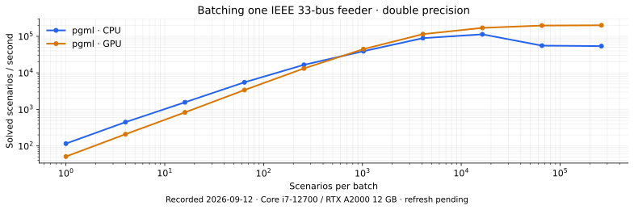
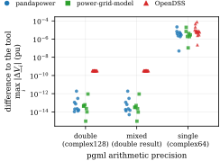
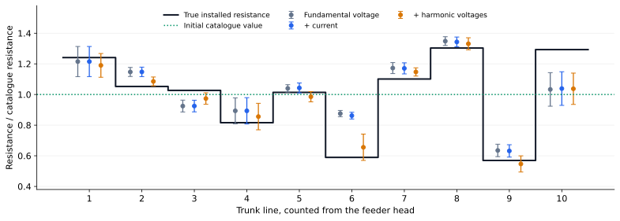

# pgml

**Differentiable power flow and harmonics for electrical grids, on CPU and GPU.**

`pgml` combines phase-domain grid modeling with PyTorch autograd. Simulate unbalanced
networks, generate batches of operating scenarios, and differentiate voltages, currents
and powers with respect to continuous grid parameters. Use those gradients to fit a
**digital twin**, optimize an operating decision, or compute sensitivities.

## Capabilities at a glance

- **Fast GPU simulations:** batch thousands of grid scenarios on CPU or GPU.
- **PyTorch integration:** differentiate simulation outputs to fit grid parameters
  or train models with a physics-based loss.
- **Fundamental and harmonic power flow:** simulate unbalanced grids at harmonic orders.

| Library | Autodiff through power flow | GPU power flow | Harmonics | Unbalanced three-phase |
|---|:---:|:---:|:---:|:---:|
| [**pgml**](https://github.com/power-grid-ml/pgml) | Yes | Yes | Yes | Yes |
| [DPF](https://github.com/Helmholtz-AI-Energy/differentiable-power-flow) | Yes | Yes | — | — |
| [SABLE (paper)](https://arxiv.org/abs/2606.07099) | Yes | Yes | — | — |
| [pandapower](https://github.com/e2nIEE/pandapower) | — | — | — | Yes |
| [PyPSA](https://github.com/PyPSA/PyPSA) | — | — | — | — |
| [power-grid-model](https://github.com/PowerGridModel/power-grid-model) | — | — | — | Yes |
| OpenDSS | — | — | Yes | Yes |

Autodiff means simulation outputs can participate in a general-purpose automatic
differentiation graph. The table describes power-flow capabilities, rather than the
backends available to a separate optimization problem. SABLE's row describes its paper.
Each library has its own supported devices, assumptions and applications.

## Performance: solve scenarios in batches



pgml solves many operating points of one grid in a single batched call, so its
throughput keeps growing with the batch size. Tools that solve one scenario at a
time level off early. Most of that gain needs no GPU: the pgml CPU curve is the
same engine on the same eight cores, split over the same eight worker processes
the other tools get.

For a few scenarios pgml is the slowest tool here. At one scenario per batch
power-grid-model solves 5,700 per second on the 33-bus feeder where pgml manages
140. pgml passes it at about 4,096 scenarios per batch and reaches 1.2 million
per second on one GPU. On grids of about a thousand buses and more it does not
pass power-grid-model at any batch size.

All tools solve identical load scenarios in double precision on the same
allocation. A point is shown only if the solution converged and matches a pgml
double-precision reference within 1e-6 pu in voltage magnitude. The plot covers
the forward power flow, without gradients.
[PERFORMANCE.md](assets/PERFORMANCE.md) explains the setup of each tool, what is
timed, how throughput changes with grid size, what each tool costs in memory and
in money, and where pgml loses.

<sub>One NVIDIA L40S 48 GB against eight physical cores of an AMD EPYC 9334, on which every CPU tool gets eight workers or eight threads. pgml 0.5.1, torch 2.13.0, pandapower 3.5.4 with numba 0.67.0, power-grid-model 1.13.172, OpenDSSDirect.py 0.9.4. complex128, median of five warm repetitions (three for the per-scenario tools), the leading 32 scenarios of every batch re-solved and compared.</sub>

## Conformance: the solvers agree



Each grid is first proven to be the identical model in pgml and in the reference
tool, then solved by both. A marker is one grid. It shows the largest difference of
any complex node voltage between pgml and the tool's own double-precision solve, for
pgml in double, mixed and single precision. Blue circles compare with pandapower,
green squares with power-grid-model, red triangles with OpenDSS.

In double precision pgml agrees with pandapower and power-grid-model at the 1e-14 pu
level in the median and within 2e-12 pu on every grid. The OpenDSS markers sit at a
constant 3.4e-10 pu, which is OpenDSS's ten-digit degree constant. With that constant
emulated in pgml the difference drops to 4e-13 pu. Mixed precision changes nothing.
Single precision costs about 5e-6 pu in the median and up to 8e-5 pu.

Differences between libraries therefore come from the model, not from the solver.
[assets/CONFORMANCE.md](assets/CONFORMANCE.md) explains both checks, shows what each
modelling difference costs, and describes the conversion report that lists what an
importer dropped, approximated or modelled differently.

<sub>pgml 0.5.1, complex128 reference at tolerance 1e-12, 1269 solves on 19 grids.
pandapower 3.5.4 with numba, power-grid-model 1.13.142, OpenDSSDirect.py 0.9.4, torch 2.13.0,
Python 3.13.15. Six CPU threads and an NVIDIA RTX A2000 12 GB.</sub>

## Accurate digital twin building

**Goal: recover line resistances from noisy measurements at 48% of buses using
Levenberg–Marquardt optimization and pgml's automatically differentiated measurement
Jacobian.**



This simulated IEEE 33-bus example jointly estimates **20 unknown parameters**:
resistance and reactance on ten trunk lines. It uses **12 operating snapshots**,
voltage magnitudes at **16 of 33 buses**, and four current measurement locations.
The initial catalogue differs from the installed values by up to **43% in resistance**
and **25% in reactance** in this realization. Topology and load injections are known.

Independent Gaussian measurement noise has standard deviations of **0.1% for
fundamental voltage**, **1% for current**, and **5% for harmonic voltage**, relative
to each measured magnitude. The last measurement set adds orders **5, 7, 11 and 13**.
The fit uses a Gaussian catalogue prior with 50% standard deviation. Points show
mean estimates and bars show one standard deviation across four noise draws.

Adding harmonic measurements reduces the recorded median absolute resistance-scale
error from **7.8% to 5.4% of catalogue resistance**, and reactance-scale error from
**12.9% to 2.8%**. Some lines remain weakly identifiable: recovering both resistance
and reactance from partial, magnitude-only measurements is an inverse problem,
and additional measurements improve different parameters by different amounts.

The plotted data and their source hashes are in [assets/readme](assets/readme).

## Install from GitHub

Requires **Python 3.13**. The distribution is `power-grid-ml`; the import is `pgml`.

```bash
pip install "power-grid-ml @ git+https://github.com/power-grid-ml/pgml.git"
```

For the included pandapower-based example and reference-grid conversion:

```bash
pip install "power-grid-ml[convert] @ git+https://github.com/power-grid-ml/pgml.git"
```

Optional extras: `convert` (pandapower/power-grid-model imports), `opendss` (OpenDSS),
`scenarios` (Parquet datasets), and `viz` (plotting).

## A first result, and its gradient

```python
import torch
import pgml
from pgml.grids import ieee33_geometry_grid
from pgml.schemas import Phase

grid, _ = ieee33_geometry_grid()               # IEEE 33-bus feeder with converter loads
load = next(a for a in grid.appliances if a.id == 83)
p = torch.tensor(float(load.p_nom_w), dtype=torch.float64, requires_grad=True)
load.p_nom_w = p                               # a grid parameter that carries gradients

state = pgml.simulate(grid)                    # harmonic power flow, orders 1, 3, ... 13
v = state.voltage(node_id=18, phase=Phase.A)   # complex phasor per order [V]
print(f"fundamental   {v.abs()[0]:8.1f} V")
print(f"5th harmonic  {v.abs()[2]:8.1f} V")
print(f"voltage THD   {state.thd(node_id=18, phase=Phase.A):8.2%}")

v.abs()[2].backward()                          # one backward pass
print(f"d|V5|/dP      {1e3 * p.grad:8.3f} V per kW of converter load")
```

The selected load power is an ordinary autograd leaf. The same approach can fit
continuous physical parameters or propagate a task loss through the solved grid.

## Entry points

| Task | Entry point |
|---|---|
| Full differentiable state | `pgml.simulate(grid, config)` |
| Serializable result | `pgml.simulate_serializable(...)` |
| Direct solver tensors | `pgml.solver.solve_power_flow`, `solve_harmonic_flow` |
| Reproducible scenario batches | `pgml.scenarios.run_scenarios`, `write_dataset` |

`SimulationConfig` describes the study; `device` and `dtype` select execution.
Non-integer harmonic orders are outside the solver's scope. Explicit modeling
presets align supported reference conventions; they do not imply complete
feature equivalence between engines.

## Development and license

Development environments use [pixi](https://pixi.sh). Run the CPU suite with
`pixi run -e cpu pytest -q`. The figure renderer is
`pixi run -e cpu python run/readme/render.py`; it uses recorded data and runs no solves.

If you use pgml in research, see [CITATION.cff](CITATION.cff).
Licensed under the [Mozilla Public License 2.0](LICENSE).
