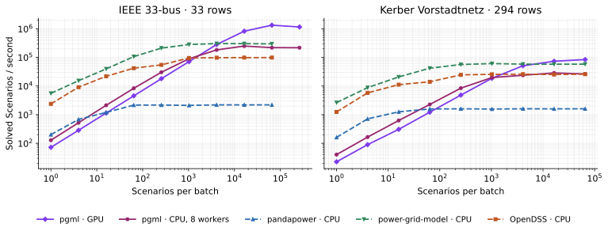
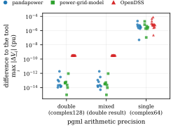
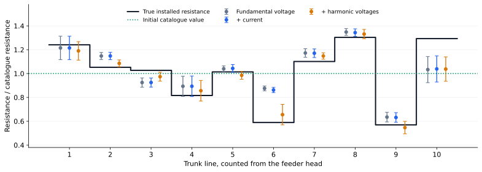

# pgml

**Differentiable power flow and harmonics for electrical grids, on CPU and GPU.**

`pgml` combines phase-domain grid modeling with PyTorch autograd. Simulate unbalanced
networks, generate batches of operating scenarios, and differentiate voltages, currents
and powers with respect to continuous grid parameters. Use those gradients to fit a
**digital twin**, optimize an operating decision, or compute sensitivities.

## Capabilities at a glance

- **Fast GPU simulations:** batch thousands of grid scenarios on CPU or GPU.
- **PyTorch integration:** differentiate simulation outputs to fit grid parameters
  or train models with a physics-based loss.
- **Fundamental and harmonic power flow:** simulate unbalanced grids at harmonic orders.

| Library | Autodiff through power flow | GPU power flow | Harmonics | Unbalanced three-phase |
|---|:---:|:---:|:---:|:---:|
| [**pgml**](https://github.com/power-grid-ml/pgml) | Yes | Yes | Yes | Yes |
| [DPF](https://github.com/Helmholtz-AI-Energy/differentiable-power-flow) | Yes | Yes | — | — |
| [SABLE (paper)](https://arxiv.org/abs/2606.07099) | Yes | Yes | — | — |
| [pandapower](https://github.com/e2nIEE/pandapower) | — | — | — | Yes |
| [PyPSA](https://github.com/PyPSA/PyPSA) | — | — | — | — |
| [power-grid-model](https://github.com/PowerGridModel/power-grid-model) | — | — | — | Yes |
| OpenDSS | — | — | Yes | Yes |

Autodiff means simulation outputs can participate in a general-purpose automatic
differentiation graph. The table describes power-flow capabilities, rather than the
backends available to a separate optimization problem. SABLE's row describes its paper.
Each library has its own supported devices, assumptions and applications.

## Performance: many scenarios at once



Speed is not the main reason to use pgml, but it has a clear sweet spot. pgml solves
many operating points of one grid in a single batched call, so its throughput keeps
growing with the batch while tools that solve one scenario at a time level off. With
thousands of scenarios of a small grid, pgml on one GPU is the fastest tool
in this comparison, and it runs the same batch on the CPU as well.

For a few scenarios, or for grids of about a thousand buses and more, a dedicated
solver such as power-grid-model is faster. Every plotted point is a converged solution
that matches a double-precision reference, with all tools solving identical scenarios
on the same allocation. [assets/PERFORMANCE.md](assets/PERFORMANCE.md) covers grid
size, harmonic studies, memory and cost, and where pgml loses.

<sub>One NVIDIA L40S 48 GB against eight physical CPU cores, complex128, forward power flow without gradients.</sub>

## Conformance: the solvers agree



Each grid is first proven to be the identical model in pgml and in the reference
tool, then solved by both. A marker is one grid. It shows the largest difference of
any complex node voltage between pgml and the tool's own double-precision solve, for
pgml in double, mixed and single precision. Blue circles compare with pandapower,
green squares with power-grid-model, red triangles with OpenDSS.

In double precision pgml agrees with pandapower and power-grid-model at the 1e-14 pu
level in the median and within 2e-12 pu on every grid. The OpenDSS markers sit at a
constant 3.4e-10 pu, which is OpenDSS's ten-digit degree constant. With that constant
emulated in pgml the difference drops to 4e-13 pu. Mixed precision changes nothing.
Single precision costs about 5e-6 pu in the median and up to 8e-5 pu.

Differences between libraries therefore come from the model, not from the solver.
[assets/CONFORMANCE.md](assets/CONFORMANCE.md) explains both checks, shows what each
modelling difference costs, and describes the conversion report that lists what an
importer dropped, approximated or modelled differently.

<sub>pgml 0.5.1, complex128 reference at tolerance 1e-12, 1269 solves on 19 grids.
pandapower 3.5.4 with numba, power-grid-model 1.13.142, OpenDSSDirect.py 0.9.4, torch 2.13.0,
Python 3.13.15. Six CPU threads and an NVIDIA RTX A2000 12 GB.</sub>

## Benefit of algorithmic differentiability

A grid model is only as good as its parameters, and the parameters of a real
distribution grid are rarely known well. Cable records are incomplete, a line's
resistance depends on the conductor that was actually laid and on its temperature,
and the catalogue value can be tens of per cent off. Meters, on the other hand, are
increasingly available. The question is how to turn a handful of noisy measurements
back into the parameters that produced them.

That is an inverse problem, and solving it needs to know how every measurement
responds to every parameter. With a conventional power-flow tool that sensitivity is
approximated by nudging one parameter at a time and solving again, so the cost grows
with every parameter added and the result depends on the step size. pgml
differentiates through the solve itself: the gradient of a fit with respect to all
line parameters costs a few forward solves, whether there are two parameters or
sixty-four, and it is exact at the fundamental and at every harmonic order. A standard
optimiser can then fit the parameters directly.



In this simulated IEEE 33-bus example, the resistance and reactance of ten trunk lines
start from a catalogue that is wrong by up to 43 per cent. The fit sees noisy voltage
magnitudes at about half of the buses, a few current measurements, and a dozen
operating snapshots, and uses a Levenberg–Marquardt optimiser on pgml's differentiated
measurement Jacobian. Each measurement set in the figure adds information, and adding
harmonic voltages at orders 5 to 13 sharpens the estimate further, because a line's
impedance changes with frequency in a way the fundamental alone does not reveal. Some
lines stay hard to pin down: recovering both resistance and reactance from partial,
magnitude-only measurements is ill-posed, and more measurements help some parameters
more than others.

The recorded experiment, with its noise levels, prior and all estimates, is in
[assets/readme](assets/readme).

## Install from GitHub

Requires **Python 3.13**. The distribution is `power-grid-ml`; the import is `pgml`.

```bash
pip install "power-grid-ml @ git+https://github.com/power-grid-ml/pgml.git"
```

For the included pandapower-based example and reference-grid conversion:

```bash
pip install "power-grid-ml[convert] @ git+https://github.com/power-grid-ml/pgml.git"
```

Optional extras: `convert` (pandapower/power-grid-model imports), `opendss` (OpenDSS),
`scenarios` (Parquet datasets), and `viz` (plotting).

## A first result, and its gradient

```python
import torch
import pgml
from pgml.grids import ieee33_geometry_grid
from pgml.schemas import Phase

grid, _ = ieee33_geometry_grid()               # IEEE 33-bus feeder with converter loads
load = next(a for a in grid.appliances if a.id == 83)
p = torch.tensor(float(load.p_nom_w), dtype=torch.float64, requires_grad=True)
load.p_nom_w = p                               # a grid parameter that carries gradients

state = pgml.simulate(grid)                    # harmonic power flow, orders 1, 3, ... 13
v = state.voltage(node_id=18, phase=Phase.A)   # complex phasor per order [V]
print(f"fundamental   {v.abs()[0]:8.1f} V")
print(f"5th harmonic  {v.abs()[2]:8.1f} V")
print(f"voltage THD   {state.thd(node_id=18, phase=Phase.A):8.2%}")

v.abs()[2].backward()                          # one backward pass
print(f"d|V5|/dP      {1e3 * p.grad:8.3f} V per kW of converter load")
```

The selected load power is an ordinary autograd leaf. The same approach can fit
continuous physical parameters or propagate a task loss through the solved grid.

## Entry points

| Task | Entry point |
|---|---|
| Full differentiable state | `pgml.simulate(grid, config)` |
| Serializable result | `pgml.simulate_serializable(...)` |
| Direct solver tensors | `pgml.solver.solve_power_flow`, `solve_harmonic_flow` |
| Reproducible scenario batches | `pgml.scenarios.run_scenarios`, `write_dataset` |

`SimulationConfig` describes the study; `device` and `dtype` select execution.
Non-integer harmonic orders are outside the solver's scope. Explicit modeling
presets align supported reference conventions; they do not imply complete
feature equivalence between engines.

## Development and license

Development environments use [pixi](https://pixi.sh). Run the CPU suite with
`pixi run -e cpu pytest -q`. The figure renderer is
`pixi run -e cpu python run/readme/render.py`; it uses recorded data and runs no solves.

If you use pgml in research, see [CITATION.cff](CITATION.cff).
Licensed under the [Mozilla Public License 2.0](LICENSE).
