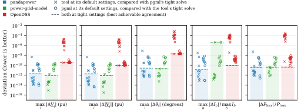
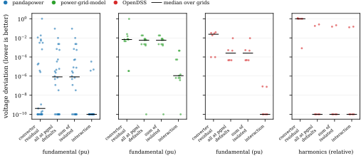
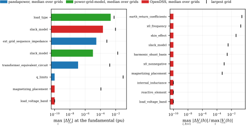
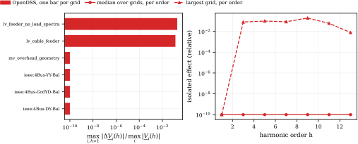

# Conformance with pandapower, power-grid-model and OpenDSS

Two libraries can disagree for two reasons. Their solvers may compute different
answers for the same equations, or they may solve different equations because they
model a transformer, a load or a line differently. pgml measures the two separately.

1. Solver conformance. The model is made identical in both libraries, proven
   identical, and then solved by both.
2. Model and converter conformance. A grid in a tool's own format is imported with
   pgml's converter. Every modelling difference is then switched on alone, so each one
   gets its own number.

The short version: on an identical model pgml agrees with every tool to better than
1e-9 pu, and with pandapower and power-grid-model to 2e-12 pu. Everything larger is a
modelling difference that pgml names in its conversion report.

## Check 1: solver conformance on an identical model

### Method

The pgml grid is the source of truth. For each tool it is projected onto what both
libraries can represent, for example an ideal slack for pandapower and a finite
Thevenin source for power-grid-model and OpenDSS, and matched with the pgml presets
`pandapower`, `power-grid-model` and `opendss`.

Before any solution is compared, the model is proven equal. pgml's per-unit
admittance matrix is compared with pandapower's internal `Ybus` and with OpenDSS's
`SystemY`, entry by entry. power-grid-model exposes no matrix, so three random linear
probe problems are solved by its direct linear method and by a numpy solve of pgml's
assembled system. The gate passes below 1e-9 on scaled entries. Where it passed it
measured 1e-16 to 1e-13. A grid that fails the gate is reported and never enters an
accuracy number.

Then both sides solve the grid at tight settings, which means double precision and a
tolerance of 1e-12. This is the reference. Each side repeats its solve, and every
solver setting is then changed alone, on the pgml side and on the tool side.

### Result


One marker per grid. The y axis is the largest difference of any complex node voltage
in per unit between pgml and the tool's own tight double-precision solve. The first
column is pgml at its reference settings, the other two are pgml in mixed and in
single precision.

| pgml against | median | largest grid | grids |
|---|---|---|---|
| pandapower | 2.2e-14 pu | 1.9e-12 pu | 9 |
| power-grid-model | 4.1e-14 pu | 9.1e-13 pu | 7 |
| OpenDSS | 3.4e-10 pu | 3.5e-10 pu | 15 |

The OpenDSS value is the same on every grid. OpenDSS converts degrees with the
ten-digit constant 57.29577951, which rotates its source by 3.4e-10 rad. With that
constant emulated in pgml the difference is 5e-14 pu in the median and 3.6e-13 pu at
most. A repeated solve is bit-identical on every engine, and a scipy fixed-point
iteration on pgml's own system agrees with pgml to 2e-13 pu.

### What the default settings cost



Every grid is solved by both sides at tight settings and by both at their default
settings. One marker per grid. A cross is the tool at its defaults compared with
pgml's tight solve. A circle is pgml at its defaults compared with the tool's tight
solve. The dashed line with the shaded region below it is the largest deviation when
both sides are tight, the best agreement the two implementations can reach. A marker
far above the dashed line means that the default settings of that side cause the
deviation, not its mathematics.

The five panels are five measures of the same comparison.

| panel | meaning |
|---|---|
| max<sub>i</sub> &#124;ΔV<sub>i</sub>&#124; (pu) | largest difference of any complex node voltage |
| max<sub>i</sub> &#124;Δ&#124;V<sub>i</sub>&#124;&#124; (pu) | largest difference of any voltage magnitude |
| max<sub>i</sub> &#124;Δθ<sub>i</sub>&#124; (degrees) | largest difference of any voltage angle, nodes above 1e-6 pu only |
| max<sub>b</sub> &#124;ΔI<sub>b</sub>&#124; / max<sub>b</sub> I<sub>b</sub> | largest difference of any branch current magnitude, relative to the largest branch current of the grid |
| &#124;ΔP<sub>loss</sub>&#124; / P<sub>loss</sub> | difference of the total series losses, relative to the losses |

The takeaway is the red crosses. OpenDSS at its default convergence tolerance of 1e-4
deviates by up to 1.7e-5 pu, far above the 3.4e-10 pu it reaches at 1e-12.
pgml, pandapower and power-grid-model default to 1e-8 and stay below 5e-9 pu. The one
green dashed line that stands out, 4e-6 in the current panel, is a single grid
(CIGRE LV) and is present at tight settings too.

### Factors and their effects

Largest change of any node voltage when one setting changes alone, over all grids at
the fundamental.

| setting | median | max |
|---|---|---|
| pgml mixed precision | 1.2e-14 pu | 2.1e-13 pu |
| pgml single precision, CPU | 5.1e-6 pu | 7.9e-5 pu |
| pgml on CUDA, double precision | 1.4e-14 pu | 4.3e-13 pu |
| pgml on CUDA, single precision | 8.1e-6 pu | 7.5e-5 pu |
| pgml linear solver dense, sparse or block | below 2e-14 pu | 2.1e-13 pu |
| pgml equilibration off | 8.3e-15 pu | 1.4e-13 pu |
| pgml Newton instead of the fixed point | 1.9e-14 pu | 2.0e-13 pu |
| pgml one thread, or six threads with batched dense | 1e-15 pu or less | 1.9e-13 pu |
| pgml four scenarios per call | 1.0e-15 pu | 4.4e-14 pu |
| pgml batched harmonic solve, low-rank or direct | 1.9e-15 pu | 3.7e-15 pu |
| pgml tolerance 1e-4 | 6.1e-7 pu | 1.7e-5 pu |
| pgml tolerance 1e-6 | 9.8e-9 pu | 7.4e-8 pu |
| pgml tolerance 1e-8, the default | 1.2e-10 pu | 1.1e-9 pu |
| pgml tolerance 1e-10 | 3.2e-13 pu | 8.9e-12 pu |
| pandapower tolerance_mva 1e-4 | 1.2e-7 pu | 1.0e-4 pu |
| pandapower tolerance_mva 1e-8, the default | 0 | 4.5e-9 pu |
| pandapower algorithms bfsw, fdbx, gs, iwamoto_nr | below 3e-13 pu | 7.7e-12 pu |
| power-grid-model error_tolerance 1e-4 | 8.0e-13 pu | 3.9e-9 pu |
| power-grid-model `linear` and `linear_current` methods | about 1.7e-3 pu | 2.1e-2 pu |
| OpenDSS Tolerance 1e-4, the default | 3.5e-6 pu | 1.7e-5 pu |
| OpenDSS Tolerance 1e-8 | 2.5e-10 pu | 2.3e-9 pu |
| OpenDSS voltages read from the text export | 8.1e-4 pu | 8.7e-4 pu |
| OpenDSS script coefficients with 6 digits | 1.0e-7 pu | 3.0e-7 pu |
| closed switch as 1e-4 Ω instead of exact fusion | 1.1e-7 pu | 7.4e-5 pu |
| reactive limits enforced on one side only | | 4.2e-2 pu |

Not representable and therefore not compared: a voltage-regulating generator in
power-grid-model and OpenDSS, a one-phase transformer with a vector-group shift in
OpenDSS, and the harmonic device shunt of voltage-dependent loads in OpenDSS. The
power-grid-model export of one SimBench MV grid fails the equality gate at 1.7e-7 pu
and is excluded.

## Check 2: model and converter conformance

### Method

Every grid starts in a tool's native form, a pandapower net, a DSS script or a
power-grid-model dataset. The tool solves it with its own model. pgml imports it with
its converter and solves it several times.

- Matched. Every modelling option is set to reproduce the tool. What remains is the
  converter residual. Where it is above the floor, each element class of the grid is
  neutralised in the native description and the residual is measured again. A class
  that brings the residual to the floor is a proven cause.
- One option alone at its pgml default, everything else matched. This is the isolated
  effect of that modelling difference.
- All options at their pgml defaults. This is what a user gets without a preset. The
  interaction is the combined effect minus the sum of the isolated effects.

Each measured cause is checked against what the converter announced. A measurable
difference without an announcement is a silent difference, and is listed below.

### The conversion report

Every importer and exporter returns a structured report of what it dropped, what it
approximated and what pgml models differently, with the preset or setting that
matches the tool.

```python
from pgml.convert.pandapower import to_grid

grid, id_map, report = to_grid(net, return_report=True)
print(report.summary())
for entry in report.model_differences:
    print(entry.key, entry.message)
```

The same call exists in `pgml.convert.opendss` and `pgml.convert.pgm`, and
`from_grid(...)` results carry `.report`.

### Converter fidelity and combined effect



One marker per grid, the black bar is the median. Converter residual is pgml against
the tool with everything matched. All at pgml defaults is the same grid without a
preset. Interaction is combined minus the sum of the isolated effects, and a large
value means several options act on the same quantity.

With everything matched the pandapower median is 4e-10 pu. The power-grid-model and
OpenDSS medians are 7e-3 and 2e-2 pu because those grid sets were written to contain
elements the importer announces as dropped or approximated: shunts, three-winding
transformers and tap regulators in power-grid-model, regulator controls and load
spectra in OpenDSS. Neutralising the announced class brings these grids to the floor,
for example 0.97 to 3e-18 pu for the three-winding transformer and 4.5e-3 to 3e-11 pu
for the shunt.

### Isolated effects, ranked



Bar is the median over grids, tick is the largest grid, colour is the tool.

| difference | tool | median | max |
|---|---|---|---|
| uniform load model against per-load types | power-grid-model | 2.2e-3 pu | 6.0e-3 pu |
| slack model | OpenDSS | 2.1e-4 pu | 9.2e-3 pu |
| source sequence impedance, three-phase | pandapower | 2.9e-5 pu | 6.9e-4 pu |
| slack model | power-grid-model | 1.0e-5 pu | 1.8e-2 pu |
| transformer T against pi equivalent | pandapower | 1.2e-7 pu | 1.6e-3 pu |
| reactive limits | pandapower | 0 | 9.2e-2 pu |
| earth-return coefficients Rg, Xg, harmonics | OpenDSS | 0 | 0.27 relative |
| zero-sequence reactance law, harmonics | OpenDSS | 0 | 0.19 relative |
| skin effect, harmonics | OpenDSS | 0 | 0.043 relative |

Harmonic medians are zero because half of the OpenDSS harmonic grids have no harmonic
source left once the load spectra are neutralised. The harmonic options interact
strongly, with a remainder of up to 0.15, because earth-return coefficients,
reactance law and skin effect all act on the zero-sequence impedance.

One isolated effect in detail, the zero-sequence reactance law of lines.



### Known silent differences and unexplained residuals

Measurable and not announced by the converter.

- pandapower MATPOWER cases with negative `i0_percent`. 6.7e-3 pu on case118. The
  imported magnetizing branch does not reproduce a capacitive no-load current.
- OpenDSS single-phase loads whose kV is not the bus base, 0.23 kV on a 0.2309 kV bus.
  9.7e-5 pu. The two tools build the voltage-dependent admittance from different
  voltages.
- OpenDSS harmonic load admittance. OpenDSS builds it from nominal power at nominal
  voltage, pgml from the solved operating point. 2.6e-3 relative.

Unexplained after every element class was neutralised.

- OpenDSS IEEE 4-bus feeders and the authored overhead geometry feeder, 1.9e-2 to
  3.9e-2 pu. The deviation sits behind the four-wire geometry lines and scales with
  load. It points to the series impedance of imported geometry lines.
- pandapower three-phase nets, 3.1e-3 pu on the authored feeders and up to 6.4e-4 pu
  on the IEEE European LV feeder. The T-circuit transformer and the zero-sequence
  magnetizing split of `runpp_3ph` cannot be matched. Both are announced, no probe
  removes them.
- pandapower `example_multivoltage`, residual 1.0. Three-winding transformers, xward
  and impedance elements are dropped, announced, and leave de-energised buses.

Refused at import and counted, not scored: OpenDSS IEEE 13, 34, 37 and 123 bus feeders
and 4Bus-OYOD (single-phase regulator windings on a non-identity phase order), 4Bus-YD
and the four-wire feeder (wye winding with an explicit neutral node), a two-phase delta
load, and the InvControl case, where pgml does not converge with the imported Volt-VAr
law.

## Reproduce

Both checks live in the [pgml paper repository](https://github.com/power-grid-ml/pgml-paper) (to be published soon) under `scripts/conformance/` and take
the pgml they find on `PYTHONPATH`. Some grid sets need further packages, which the
paper repository lists.

```bash
export PYTHONPATH=<pgml>/src:<paper>/scripts/conformance

# check 1
python scripts/conformance/solver_conformance/run.py --out runs/solver --no-large
python scripts/conformance/solver_conformance/aggregate.py --run runs/solver
python scripts/conformance/solver_conformance/figures.py --run runs/solver
python scripts/conformance/solver_conformance/report.py --run runs/solver

# check 2
python -m model_conformance.run --out runs/model --tools pandapower,opendss,pgm --sizes small,medium
python -m model_conformance.roundtrip --out runs/model --studies fundamental,unbalanced
python -m model_conformance.aggregate --runs runs/model --out runs/model
python -m model_conformance.figures --summary runs/model/summary.json --out runs/model/figures
python -m model_conformance.report --summary runs/model/summary.json --out runs/model/report.md
```

Every figure is written as PDF and SVG with its numbers as JSON and a generated
caption as `<name>.caption.txt`. The copies used here are in `assets/readme/` with
their hashes in `assets/readme/provenance.json`.

<sub>pgml 0.5.1. Check 1: 1269 solves on 19 grids, CPU and CUDA.
Check 2: 669 rows on 68 grid and study pairs, orders 1 to 25, floors 1e-6 pu and 1e-4 relative.
pandapower 3.5.4 with numba 0.65.1, power-grid-model 1.13.142, OpenDSSDirect.py
0.9.4, torch 2.13.0, Python 3.13.15, six CPU threads, NVIDIA RTX A2000 12 GB.
SimBench was not installed in that environment, so the SimBench cases of check 2 were skipped.</sub>
