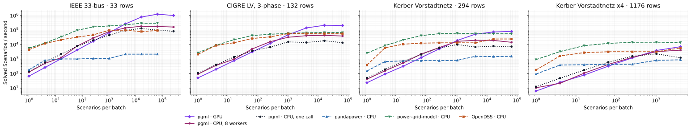
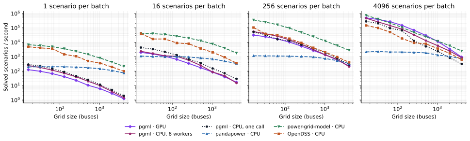
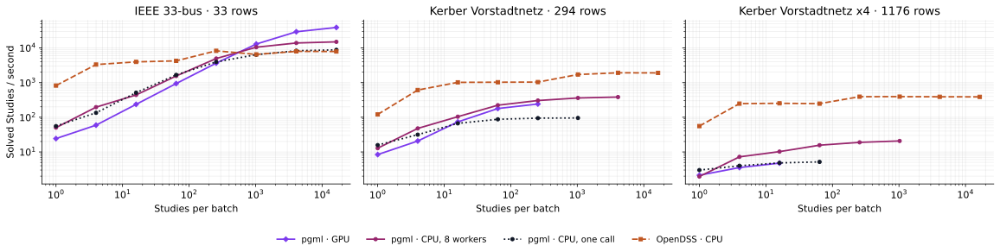
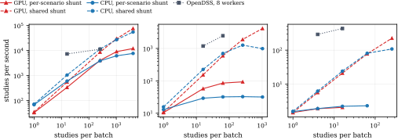
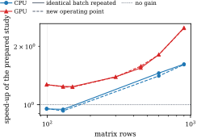
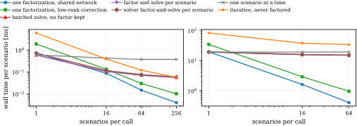
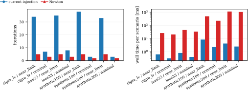
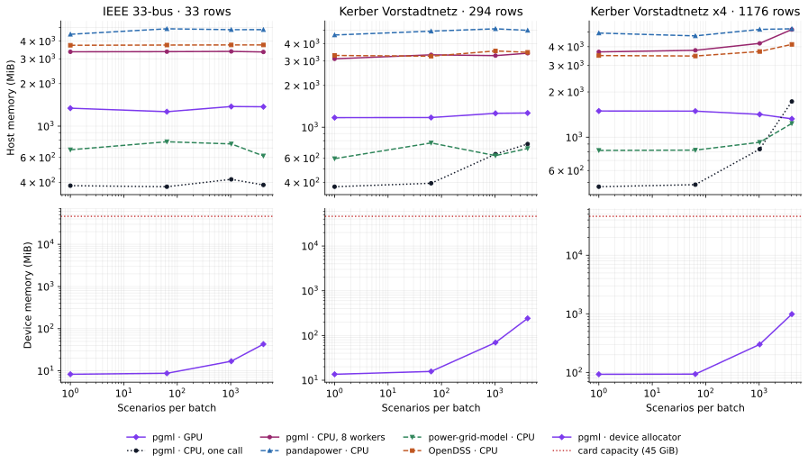
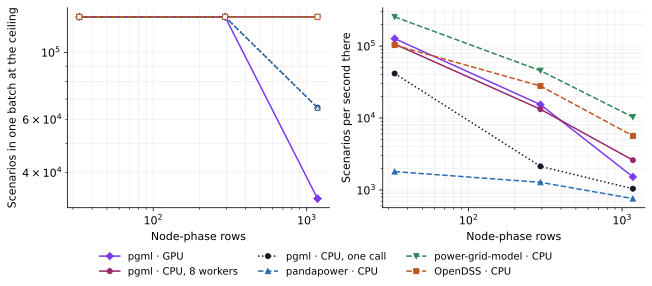
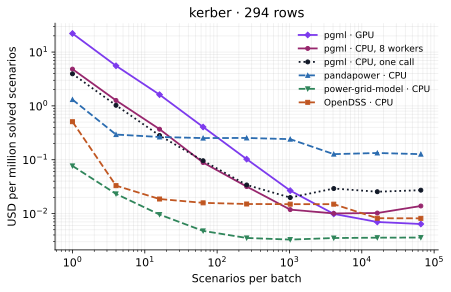

# How the performance figures are measured

This page explains the throughput figure in the README and adds the rest of the
comparison: grid size, harmonic studies, memory, capacity and cost. The numbers come from
the benchmark scripts of the
[pgml paper repository](https://github.com/power-grid-ml/pgml-paper) (to be published soon). The figures here are drawn from the recorded results by
`run/readme/render.py`, which runs no experiment.

Read the summary first if you are deciding whether to use pgml: it says where
pgml wins and where it loses.

## What is compared, and on what

Each tool solves the same problem for many load scenarios of one grid.
Throughput is the number of scenarios divided by the wall time of one call.

The comparison is between tools, on one stated allocation, with the same
parallelism everywhere. One measurement uses either one GPU or eight physical
CPU cores; nothing uses both.

| Tool | Hardware | How it is run |
|---|---|---|
| pgml on the GPU | one NVIDIA L40S 48 GB | one batched call, complex128, dense factorisation |
| pgml on the CPU, 8 workers | 8 physical cores | eight worker processes with one thread each; each solves its share of the batch in one batched call |
| pgml on the CPU, one call | 8 physical cores | one batched call in one process; the sparse backend on eight threads, the dense backend on one thread above 128 rows |
| pandapower | 8 physical cores | `runpp` per scenario with numba, the pi transformer model and recycled network matrices, over eight worker processes with one primed network each |
| power-grid-model | 8 physical cores | its native batch calculation with the iterative-current method and eight threads |
| OpenDSS | 8 physical cores | OpenDSSDirect.py, eight worker processes with one thread each, each with one compiled circuit |

Eight physical cores means an allocation of sixteen logical cpus on a machine
with two hardware threads per core. Every result records the affinity mask it
ran under and the physical core count derived from the core topology, so the
allocation is a measured property of the run rather than an assumption.

### Why pgml appears twice on the CPU

The two CPU rows are the same engine used in two ways, and they answer different
questions.

The eight-worker row is the like-for-like comparison: it gives pgml exactly the
parallelism pandapower and OpenDSS get, so the CPU columns differ by engine and
not by how the work was spread. It is also the only CPU configuration in which
pgml's batched dense factorisation is trustworthy on this build of PyTorch:
`torch.linalg.lu_factor` on a batch of complex matrices of 200 rows or more
returns invalid pivots when it runs on more than one thread, so a single-process
dense solve above 128 rows is pinned to one thread. Eight single-threaded
processes never reach that path.

The one-call row is how a user writes pgml: one `solve_power_flow` on a batch. It
is faster at small batches, where handing scenarios to worker processes costs
more than it saves, and it is what the same code does on a GPU.

### What is still not identical

- The three process-pool tools (pgml's pooled arm, pandapower, OpenDSS) pay for
  sending scenarios to their workers and results back inside the timed call. The
  two in-process tools (power-grid-model, pgml's single call) do not. That is a
  genuine cost of running an engine over processes and it is why the pooled arms
  lose at a batch of one.
- pgml and OpenDSS build the same harmonic device shunt but not quite the same
  line impedance above the fundamental. The harmonic comparison is therefore
  accepted at 1e-4 per unit rather than the 1e-6 the fundamental comparison uses,
  and each recorded point carries the tolerance it was judged at.
- pandapower and power-grid-model have no harmonic power flow, so the harmonic
  figure has one reference tool instead of three.
- The measurements ran on a node shared with other jobs.

## Grids and scenarios

The batch figures use the IEEE 33-bus feeder, the CIGRE low-voltage benchmark
solved in three phases, the Kerber Vorstadtnetz Kabel 1 with 294 buses, and four
merged copies of it with 1,176 buses. All come from pandapower. The Kerber
builder draws cable types at random, so its seed is fixed.

The size figure uses a family of radial 20 kV feeders with 16 to 4,096 buses.
Every grid has eight feeder branches of identical cable segments and one load per
bus, and exists as a pandapower network, so every tool solves the same case at
every size.

A scenario multiplies the active and reactive power of every load by its own
factor, drawn uniformly between 0.8 and 1.2 with a fixed seed. The scenarios are
drawn once for the largest batch. Smaller batches use the first rows, so all
tools and all batch sizes see identical inputs.

A harmonic study is one nonlinear solve at the fundamental plus one linear solve
at each odd order up to 25, with a six-pulse converter spectrum on a quarter of
the loads. It is a different amount of work from a power flow, so it is counted
and plotted separately.

## What is timed

One timed call solves one whole batch. Each configuration gets one untimed
warm-up call followed by five timed repetitions, or three for the per-scenario
tools. The figures show the median.

Inside the timed region are the solve itself and, for the process-based tools,
the hand-over of scenarios to the workers and of results back.
GPU timings synchronise the device before the clock starts and before it stops.

Outside the timed region are grid conversion, building each tool's model, moving
pgml inputs to the GPU and all correctness checks. Each worker pool is created
once and each worker builds its model once: pandapower's workers unpickle and
prime their own network, OpenDSS's workers compile their circuit, pgml's workers
build their grid and solve once, so no timed call ever lands on a process that
has not solved before.

## Validity guard

A throughput value is kept only if the solution is correct. The leading 32
scenarios of every timed batch are re-solved outside the clock and their voltage
magnitudes compared with a pgml CPU complex128 reference, and a batch smaller
than that is checked in full. The point counts if the
tool reports convergence and the largest difference stays within the tolerance
recorded with it. Points that fail are recorded without a throughput and cannot
reach a figure. The renderer repeats the check on the recorded values and refuses
to draw an invalid point.

The pandapower runs fail at the start if numba cannot be imported, and every
worker confirms that pandapower really used numba and the pi transformer model.

## Results

### Batch size



pgml's throughput grows almost in proportion to the batch size, because one
batched call shares its fixed cost among all the scenarios in it. The reference
tools solve one scenario at a time and level off once their worker pool is busy.

At one scenario per batch the order is reversed and pgml is last. power-grid-model
solves 5,700 scenarios per second on the 33-bus feeder and 2,600 on the Kerber
network where pgml manages 140 and 50. That is the fixed cost of a batched
solver being paid by a batch of one.

Where the curves cross, against each reference tool, taking the fastest pgml arm
on the device:

| Grid | against pandapower | against OpenDSS | against power-grid-model | lead at the largest common batch |
|---|---|---|---|---|
| IEEE 33, 33 rows | 16 | 4,096 | 4,096 to 16,384 | 4.2x power-grid-model at 65,536 |
| CIGRE LV, 132 rows | no arm | 4,096 | 4,096 | 3.1x at 16,384 |
| Kerber, 294 rows | 64 | 1,024 | 16,384 to 65,536 | 1.5x at 65,536 |
| Kerber x4, 1,176 rows | 256 | 1,024 | never | 0.5x at 4,096 |

A crossover is given as a range where the two curves are within 1.5 times of
each other at the batch where they cross, because repeating a measurement on
this shared machine moves a tool by up to half as much again.

The pattern is the point. The batch at which pgml overtakes power-grid-model
rises with the grid, and the lead it reaches afterwards falls: four times on a
33-row feeder, three times at 132 rows, one and a half times at 294 rows, and on
the 1,176-row network it does not overtake it at any batch measured.

The 1,176-row row is measured only to 4,096 scenarios per batch, where
power-grid-model is about twice as fast. The grid-size figure below, where all
four batch sizes were measured at every rung, is the evidence for what happens
above a thousand rows.

pgml on eight CPU worker processes follows the same shape one level down. It
overtakes pandapower at the same batch sizes and OpenDSS on the smallest grid,
and it never overtakes power-grid-model.

pandapower's three-phase solver cannot solve the converted CIGRE LV network, so
that arm is absent rather than slow.

### Grid size



Here the batch is fixed and the grid grows from 16 to 4,096 buses, every grid a
pandapower network every tool solves. pgml factorises a dense matrix on the GPU,
and on the CPU the faster of a dense and a sparse factorisation is shown. The
reference tools use sparse solvers that exploit the radial structure, so they
lose less speed as the grid grows.

At one and at sixteen scenarios per batch pgml is the slowest tool at every size.
It becomes competitive at 256 and leads at 4,096, and only up to a point. Taking
power-grid-model as the tool to beat, pgml on the GPU at 4,096 scenarios per
batch is 1.4 times faster at 256 buses, 1.2 times at 512, and behind from 1,024
buses upward, reaching 0.37 times at 4,096 buses. Against OpenDSS at the same
batch pgml stays ahead at every size, by 7.4 times at 256 buses falling to 1.5
times at 4,096. Against pandapower pgml leads from 256 scenarios per batch at
almost every size.

pgml on eight CPU worker processes never overtakes power-grid-model at any size
or batch measured here.

### Harmonic studies



A study is one nonlinear solve at the fundamental plus a linear solve at each of
twelve further odd orders. OpenDSS is the only reference tool that can do it;
pandapower and power-grid-model have no harmonic power flow.

Above the fundamental a load is a harmonic current source in parallel with a
shunt admittance `conj(P + jQ)/V_rated²`, which OpenDSS splits half and half
between a parallel and a series R-L branch. `P`, `Q` and `V_rated` are the values
declared on the element, not quantities read off the fundamental solution: the
same load returns the same order-5 admittance whether its terminal settles at 224
or at 217 volts. What the fundamental solution carries is the current injection,
whose magnitude and angle follow the element's own fundamental current.

A scenario here multiplies every load's declared power, so every shunt in the
circuit moves with it. OpenDSS's admittance scales exactly with the edited power
and the system matrix is rebuilt whenever an element's is, and again at every
order because branch reactances scale with frequency. Both engines therefore
factorize one matrix per scenario and per order. OpenDSS never holds more than
one of them, because it solves the scenarios one after another; pgml assembles
the whole batch at once, and that is where its memory goes.

pgml's default builds the same expression from the power the device draws at the
converged fundamental over the same rated voltage, which for a constant-power
device is the declared power. That is the configuration in the figure above and
the one that reproduces OpenDSS. On sixteen scenarios of the 33-bus feeder the
two engines agree to 3.2e-5 per unit on harmonic voltages of about 1.9e-2 per
unit. The arm is nonetheless accepted at 1e-4 rather than 1e-6, because the two
line models still differ above the fundamental.

On the 33-bus feeder OpenDSS levels off near 8,000 studies per second. pgml
passes it at about 1,000 studies per batch and reaches 39,000 on the GPU and
15,000 on eight CPU workers at 16,384 studies, so 4.9 and 1.9 times OpenDSS.

On the two larger grids pgml loses, and by a wide margin. On the 294-row Kerber
network OpenDSS reaches 1,900 studies per second against 383 for pgml's best
arm, and on the 1,176-row network 390 against 21. pgml never overtakes OpenDSS
on either.

#### What the per-scenario matrix costs



`load_shunt_basis="nameplate"` builds the shunt from each device's stored power
instead and ignores the scenario, so `Y(h)` is one matrix per order shared by the
whole batch and one factorization per order answers all of it. It is the cheaper
model and it is a different one. On the 33-bus feeder it sits 1.6e-4 per unit
from OpenDSS against 3.2e-5 for the default, five times further away and past the
1e-4 this arm is accepted at; on the two Kerber networks, where the loads are
smaller against the source, it is about twice as far and still inside.

Measured on a workstation card, each basis at its own fastest batch, against
OpenDSS on the same scenarios in the same job:

| Grid | OpenDSS, 8 workers | pgml GPU, per-scenario shunt | pgml GPU, shared shunt | agreement, per-scenario | agreement, shared |
|---|---|---|---|---|---|
| IEEE 33, 33 rows | 11,300 | 12,100 | 76,200 | 3.2e-5 | 1.6e-4 |
| Kerber, 294 rows | 2,470 | 93 | 4,130 | 8.5e-6 | 1.6e-5 |
| Kerber x4, 1,176 rows | 434 | 2.1 | 225 | 9.7e-6 | 1.6e-5 |

Throughput is studies per second, agreement the largest difference in per-unit
voltage magnitude. So the matched model is the one that costs, and it costs a
factor of six on the smallest grid and a hundred on the largest. With it, pgml
matches OpenDSS on the 33-bus feeder and is 27 and 207 times slower on the two
larger ones. Without it, pgml is seven times OpenDSS on the feeder and 1.7 times
on the 294-row network, and still half its speed at 1,176 rows.

The solver does not hold the whole `[B, H, N, N]` admittance. It assembles and
factors as many scenarios at a time as fit `solver.harmonic.system_budget_mb` and
concatenates the results, so the peak is bounded by that budget and not by the
batch. On the 294-row network the device peak holds at 1,540 and 1,552 MiB
while the nominal admittance grows from 1.07 to 4.29 GiB, and on the 1,176-row
network at 1,534 MiB against a nominal 4.29 GiB. The shared shunt needs 114 and
998 MiB for the same batches, because there is one matrix per order rather than
one per scenario. The harmonic curves above stop earlier than the fundamental
ones because the benchmark refuses a batch whose nominal admittance exceeds its
own device budget, which is a harness guard rather than a capacity of the card.

An exact alternative exists and does not apply here. The solver can factor the
shunt-free network once and reach each scenario's own matrix through a low-rank
correction, which is selected when three times the number of node-phase rows a
device shunt touches stays below the row count. A distribution feeder carries a
load on most buses, so that number is 32 of 33 rows on the IEEE feeder and 146 of
294 and 584 of 1,176 on the two Kerber networks. At half the rows a low-rank
correction costs more than a fresh factorization, so the per-scenario assembly is
what runs.

<sub>This subsection only: measured 2026-09-24, library 0.5.1, complex128, thirteen orders,
one NVIDIA RTX A2000 12 GB and the CPU of a 16-core workstation, medians of three repeats
after warm-up; the CPU arm runs on one thread wherever the dense backend is selected,
for both bases alike. Agreement is the largest absolute difference in per-unit voltage
magnitude against a live OpenDSS on the matched circuit over the same sixteen scenarios.</sub>

## Solver configuration

The comparison above runs the solver's defaults. Three choices inside the solver
change what it costs, measured separately on a workstation card.



A `HarmonicFlowSystem` passed as `system=` keeps the factored fundamental system, the harmonic
network matrix for the requested orders, and the factorization of the assembled `Y(h)`.
Everything that depends on the operating point is recomputed: the fundamental power flow is
solved again, the device shunts are evaluated from the new solution, and `I(h)` is rebuilt.
Reuse is decided by value, not identity, and an unchanged operating point is neither necessary
nor sufficient for it. Network assembly and an operating-point-independent factorization are
reused across genuinely different scenarios; a `load_shunt_basis="operating_point"` shunt puts
the scenario into `Y(h)`, and then only the network entry is reusable.

Whether the preparation pays depends on the device. On eight CPU threads at complex128 and
orders 1 to 13 it is a loss at 99 rows in every configuration, clears 1.0x between 129 and 600
rows, and returns 1.38x to 1.62x at 900 rows. On one RTX A2000 it pays at every size measured,
1.12x to 1.27x at 99 rows and 1.38x to 2.49x at 900, with the gain growing with the grid.
Retention with an operating-point-independent `Y(h)` is 4 MiB at 99 rows and 247 MiB at 900;
with a per-scenario `Y(h)` it reaches 804 MiB for 32 scenarios of a 300-row feeder, because
the validity check keeps a copy of the matrix beside its factorization.



On the linear algebra itself, a dense direct solve factorizes too: solving the assembled
matrix and keeping an explicit factorization cost the same to within one percent at all 24
measured points, so there is nothing to gain by not refactorizing. What pays is reuse. One
factorization of a shared network answers 64 scenarios of a 900-row feeder in 26 ms against
960 ms for one factorization each (37x), and where the change is structured, one factorization
of the shunt-free network plus an exact Woodbury correction reaches each scenario's own matrix
in 62 ms (15.6x) at 6.6e-13 relative agreement. Solving one scenario at a time instead of
batching costs 4.1x to 12.6x. A Jacobi-preconditioned iterative solve that never factorizes is
2x to 5x slower at complex128 and does not reach the tolerance at complex64.



The two fundamental methods converge to the same solution. The current-injection fixed point
takes 3 to 8 iterations at nameplate loading and 32 to 36 near its convergence limit; Newton
takes 2 to 5 throughout. Newton is nonetheless 2.0x to 26x slower per unbatched solve and 41x
to 424x slower on a batch of 32, because every step rebuilds and factors the state Jacobian and
a batch is solved one scenario at a time. Both carry the same implicit-function-theorem
backward at the converged voltage, so the gradients are identical and equally conditioned.

<sub>This section only: measured 2026-09-24, library 0.5.1, complex128 unless stated, one NVIDIA RTX A2000 12 GB and
eight CPU threads of a 16-core workstation, medians of five to seven repeats after warm-up,
every solution validated by the residual of the system it claims to have solved.</sub>

## Memory



Each point is one fresh interpreter that builds one tool's model, brings up its
worker pool and solves one batch. While the solve runs, the whole process tree is
sampled and the largest total is kept. The figure shows the proportional set
size, which splits a page shared between worker processes between them; the
resident sum, which counts such a page once per process, is in the data as well
and is 10 to 40 per cent higher for the pooled tools. Device memory is the
PyTorch allocator's peak, which excludes the CUDA context.

Nothing is subtracted. The tree at rest, measured after the model is built and
the pool is up but before the solve starts, is recorded beside the peak.

Host memory at the largest measured batch, in MiB:

| Tool | IEEE 33 | Kerber, 294 rows | Kerber x4, 1,176 rows |
|---|---|---|---|
| pgml CPU, one call | 383 | 757 | 1,728 |
| power-grid-model, 8 threads | 616 | 703 | 1,235 |
| pgml GPU | 1,372 | 1,266 | 1,324 |
| pgml CPU, 8 workers | 3,354 | 3,415 | 5,210 |
| OpenDSS, 8 workers | 3,761 | 3,467 | 4,146 |
| pandapower, 8 workers | 4,827 | 4,994 | 5,265 |

Three things follow.

A worker pool costs about 3 GB before it solves anything, because eight
interpreters each hold their own copy of the library. That cost barely moves with
the grid or the batch, so it dominates every small job. pgml's pooled arm and
OpenDSS pay it; pandapower pays it and a little more.

A single process is far leaner. pgml in one batched call and power-grid-model in
its native threaded batch both stay under 2 GB at every point measured, and
pgml's single call is the smallest of all on the two smaller grids. pgml on the
GPU needs about 1.3 GB on the host, almost all of it the CUDA runtime, and then
grows on the device instead.

Device memory has two parts. The matrix and its factorisation do not depend on
the batch and grow with the square of the grid, 8 MiB on the 33-bus feeder and 93
MiB on the 1,176-row network. Everything the iteration carries has a scenario
axis and grows with the batch and linearly with the grid, 9 KiB per scenario on
the 33-bus feeder, 57 KiB on Kerber and 224 KiB on the 1,176-row network. At
4,096 scenarios the second part is by far the larger, giving 43 MiB, 242 MiB and
988 MiB in total.

### What the memory is made of

The three groups in the table are three different things, and what separates them
is not the engine.

A worker pool holds nine interpreters, one parent and eight workers, and each of
them imports the library, builds its own model of the grid and keeps its own
working arrays. A page mapped by several of them is already split across them by
the proportional set size, so those three gigabytes are pages no other process
holds. They are there before the first scenario is solved. Measured at rest,
with the pool up and nothing solving, pgml over eight workers stands at 2.9 to 3.6 GB, OpenDSS at 3.3
to 3.5 and pandapower at 4.3 to 4.9, and the grid and the batch barely move those
numbers.

One process holds the same things once. pgml in a single batched call stands at
330 to 360 MiB with the grid loaded and its injection plan built,
power-grid-model at 590 to 820 MiB with its model built, and pgml on the GPU at
about 650 MiB on the host, most of which is the CUDA runtime. What a pgml process
then adds for the work itself is one admittance matrix, one factorisation of it,
and one tensor per quantity the iteration carries, each of them with a scenario
axis.

That is why the two kinds of tool grow differently with the batch. On the
1,176-row network, measured between one scenario and 4,096:

| Tool | standing | added per scenario |
|---|---|---|
| pgml CPU, one call | 356 MiB | 315 KiB |
| pgml GPU | 672 MiB on the host | 224 KiB on the device |
| power-grid-model, 8 threads | 817 MiB | 104 KiB |
| OpenDSS, 8 workers | 3,480 MiB | 163 KiB |
| pgml CPU, 8 workers | 3,620 MiB | 379 KiB |
| pandapower, 8 workers | 4,614 MiB | 84 KiB |

A per-scenario engine needs only the scenario it is solving, so what grows with
the batch is the input matrix and the result array and nothing else. pgml keeps
every scenario of the batch in flight, so it pays about three times as much per
scenario, and a batched factorisation and a batched back-substitution are what it
buys with that.

The two costs cross. On the 1,176-row network one pgml process passes
power-grid-model at about 2,000 scenarios per batch and the three-gigabyte pools
at about 10,000. Below that pgml is the leanest way to solve the case, and above
it the pool's standing cost has been amortised while pgml is carrying the batch.

The lean end is worth something concrete. Eight worker processes need about 4 GB
before they solve anything, so a 4 GB container cannot start pandapower's arm at
all, while pgml solves the same grid there in one process with room for about
twelve thousand scenarios in the batch. The other end is worth something too, and
it is the next section.

### What fits on a 48 GB card

The capacity search doubles the batch until the device runs out of memory.

| Grid | largest batch measured to fit | device memory there | how the search ended |
|---|---|---|---|
| Kerber x4, 1,176 rows | 131,072 | 29.4 GiB | 262,144 ran out of memory |
| Kerber, 294 rows | at least 262,144 | 14.3 GiB | stopped at the search cap |
| IEEE 33 | at least 262,144 | 2.2 GiB | stopped at the search cap |

Only the first row is a capacity. The other two are lower bounds: the search
reached its own cap with the card less than a third full, so the real limit is
higher and was not measured.

## Filling the machine with scenarios

Every figure above fixes the batch and compares speed. The other question is how
many scenarios a machine holds at once, and how fast they are solved when it is
full. It is worth asking because the tools answer it differently. A per-scenario
engine never holds more than the scenario it is working on, so its batch is a
convenience; pgml holds the whole batch and gets its speed from it, so its batch
is a resource.

The measurement fills one workstation, an RTX A2000 with 12 GB beside sixteen
CPUs. That is a much smaller accelerator than the L40S every figure above uses,
so these numbers say what one workstation does and are not a second reading of
the comparison. For each tool and grid the batch doubles until the memory
ceiling is passed, a probe runs out of memory, the batch cap of 131,072 is reached or one
solve takes longer than a minute. The ceiling is 10.5 GiB of device memory for
the GPU arm and 32 GiB of host memory for every other arm, measured the way the
memory figure measures it, with nothing subtracted. Every probe runs in its own
interpreter, so a failure ends the probe and not the search. A search that ended
at the cap or the time limit is a lower bound and not a capacity, and the figure
draws those with an open marker.



Scenarios per second at the batch each tool reached:

| Tool | IEEE 33 | Kerber, 294 rows | Kerber x4, 1,176 rows |
|---|---|---|---|
| power-grid-model, 8 threads | 254,800 | 45,500 | 10,300 |
| pgml GPU | 126,900 | 15,400 | 1,500 |
| pgml CPU, 8 workers | 106,600 | 13,200 | 2,600 |
| OpenDSS, 8 workers | 103,200 | 27,900 | 5,700 |
| pgml CPU, one call | 41,600 | 2,100 | 1,000 |
| pandapower, 8 workers | 1,800 | 1,300 | 760 |

Every one of those batches is 131,072, the search cap, with three exceptions. pgml
on the GPU at 1,176 rows ran out of device memory at 65,536 and is reported at
32,768, which is the only measured capacity in the whole table. pgml's single call
and pandapower at 1,176 rows passed the one-minute budget at 65,536 and are
reported there.

What held those batches on the largest grid: power-grid-model 14.5 GiB of host
memory, pgml over eight workers 30.9, pgml's single call 15.8, pandapower 7.3,
OpenDSS 7.1, and pgml on the GPU 7.2 GiB of device memory for a quarter of the
batch.

Three things come out of it.

Memory is rarely what stops a tool. On the two smaller grids every arm reached
the batch cap or its own time limit with the ceiling untouched, and on the
largest grid only the GPU arm was stopped by memory. What limits a study on this
machine is time, and after that price. Memory decides whether a tool fits at all,
which is what the previous section is about, and then stops deciding.

power-grid-model is first at capacity on every grid here, by a factor of two on
the 33-bus feeder and nearly seven on the 1,176-row network. That is a different
order from the fixed-batch figures above, where pgml on the GPU leads it four
times over on the 33-bus feeder. The metric is not what changed. The accelerator
is: an RTX A2000 is a workstation card with a fraction of an L40S's
double-precision throughput, and pgml's GPU arm is the one arm that depends on
it. Who wins therefore depends on which accelerator is bought at least as much as
on how the batch is chosen, which is why neither number should be read as a
ranking of engines.

The metric itself rewards a property only one tool has. A per-scenario engine
never needs its scenarios resident, so filling the machine measures pgml's design
and very little about the others, and their throughput at capacity is the plateau
the batch figure already showed. The number is worth reporting because it says
what a single call can hold, not because it settles anything.

<sub>This section only: measured 2026-09-24, library 0.5.1, complex128, one NVIDIA RTX
A2000 12 GB and sixteen CPUs of one workstation on an idle node, eight worker processes or
eight threads for every arm that uses them, one engine at a time, every probe in a fresh
interpreter.</sub>

## Cost

Throughput alone does not say whether an accelerator is worth using, because one
GPU and eight CPU cores are not the same thing to rent. This converts the
measured throughput into money at published list prices: at a price `p` per
instance-hour and a throughput `T` scenarios per second, a million scenarios cost
`1e6 / (T * 3600) * p`.

This is a price model, not a measurement. Nothing here was paid, and spot or
committed-use rates change the ratios several-fold.

| Priced as | Instance | USD per hour |
|---|---|---|
| the GPU side | one NVIDIA L40S 48 GB with four vCPU | 1.861 |
| the CPU side | sixteen vCPU, eight physical cores | 0.714 |

Both are on-demand, Linux, US-region list prices read on 2026-09-24. A second
provider selling the same L40S by the hour lists it at 1.09, and a community tier
of the same listing at 0.79, so the accelerator side of every ratio below moves
by up to a factor of two depending on where it is bought. The instance price
includes the host, so an idle host on a GPU-bound job is paid for either way.

The ratio that matters is 2.6: the GPU instance costs 2.6 times the CPU
instance. A pgml GPU throughput less than 2.6 times the best CPU throughput
means the CPU allocation is the cheaper way to buy those solves, however much
faster the card is.



Cost per million solved scenarios, each tool at its own fastest measured batch:

| Tool | IEEE 33 | CIGRE LV, 132 rows | Kerber, 294 rows |
|---|---|---|---|
| pgml GPU | 0.00041 | 0.00242 | 0.0064 |
| power-grid-model | 0.00067 | 0.00292 | 0.0033 |
| OpenDSS | 0.00203 | 0.00343 | 0.0082 |
| pgml CPU, 8 workers | 0.00108 | 0.0046 | 0.0101 |
| pgml CPU, one call | 0.00152 | 0.0108 | 0.0198 |
| pandapower | 0.0906 | no arm | 0.127 |

pgml on the GPU is the cheapest way to buy these solves on the two smaller grids
and 1.9 times power-grid-model's price on the 294-row network. The cost crossover
comes at a smaller grid than the throughput crossover, and that is the point of
pricing at all: pgml is still faster than power-grid-model on the Kerber network
at a large batch, and it is already the more expensive way to get the answer,
because the accelerator costs 2.6 times the eight cores.

pandapower is two orders of magnitude more expensive per scenario than anything
else here.

## Where pgml wins and where it loses

Use pgml when you need many operating points of a small or medium grid, or when
you need gradients through the solve, which no other tool here offers. Use a
dedicated solver when you need a few answers, or when the grid is large.

pgml wins

- on batches of thousands of scenarios on grids of a few hundred node-phase rows
  or fewer, where one batched call amortises the fixed cost of a solve over the
  whole batch;
- against pandapower almost everywhere above a few dozen scenarios per batch;
- against OpenDSS at 4,096 scenarios per batch at every grid size measured;
- on cost per million scenarios on the smallest grid, where it is also the
  cheapest tool in this comparison.

pgml loses

- at a few scenarios, badly. At one scenario per batch it is the slowest tool
  here at every grid size, by one to two orders of magnitude. A batched engine
  pays its fixed cost once whether the batch holds one scenario or a hundred
  thousand.
- against power-grid-model from about a thousand node-phase rows upward, at
  every batch size measured. power-grid-model is the tool to beat in this
  comparison, and on larger grids it is not beaten.
- on harmonic studies of anything but the smallest grid, where OpenDSS is five to
  nineteen times faster.
- on standing memory whenever it is run over worker processes: eight
  interpreters cost about 3 GB before any scenario is solved.

One further thing a reader should take from the numbers rather than from the
headline.

Most of the batching gain is available without a GPU. pgml on the same eight
cores the other tools get captures a large part of it, and the accelerator adds a
further factor that only pays above a few thousand scenarios per batch. The GPU
instance also costs 2.6 times the CPU instance, so a speed-up below 2.6 times is
not a saving.

### Why the large grids go the other way

That pgml factorises a dense matrix while the reference tools exploit the radial
structure is only part of the reason, and on the CPU it is not the reason at all.
Timing the phases of one batched solve says where the time goes.

Above 512 node-phase rows pgml's CPU path already factorises sparsely, and the
factorisation is a good one. It keeps a fill-reducing ordering, and on a radial
feeder that ordering comes within six per cent of the zero-fill optimum: the
factors hold four nonzeros per row at 1,176 rows and again at 4,096, so the
factorisation is linear in the grid. It is computed once per solve and reused by
every iteration and every scenario, which is what power-grid-model does too. At
4,096 scenarios per batch on the 1,176-row network, assembly and factorisation
together are two and a half per cent of the wall time. Neither a better ordering
nor a cheaper factorisation is where the gap lives.

What costs is the work repeated for every scenario in every iteration. In that
same solve the back-substitutions are 52 per cent of the wall time, the
device-current evaluation 16, the per-unit convergence test 15 and the residual
product 3, leaving 12 per cent of bookkeeping the phase timers do not attribute.
Nor is the back-substitution all solving: handing a batch of right-hand sides to
SuperLU means permuting a torch tensor into a Fortran-ordered numpy block and the
answer back again, and that copying is 30 to 40 per cent of the call.

On the GPU it is the simple story. The factorisation is dense, so one scenario's
back-substitution costs the square of the row count where a sparse one costs a
small multiple of it. A batch amortises the factorisation over every scenario in
it; it does not amortise the back-substitution, which every scenario pays in
full. That is why the GPU curve falls away with the grid at every batch size.

Four changes would narrow it, in the order of what they are worth. A sparse
back-substitution on the device would take the per-scenario cost from the square
of the grid to a small multiple of it, which is the whole of the large-grid gap,
and it needs a batched sparse triangular solve that torch does not have today.
Keeping the right-hand sides in one array layout would remove the copying around
SuperLU, about a fifth of a large CPU solve. Fusing the per-iteration passes,
which today walk a scenarios-by-rows tensor once each for the device currents,
the residual and the two convergence criteria, is worth about as much again.
Keeping the assembly and the factorisation across calls, which the harmonic path
already offers, is worth little inside one large batch and a great deal to a
caller that solves the same grid again and again at a small batch.

One more thing the timings show, which costs nothing here and a great deal
elsewhere. pgml assembles the admittance as a dense matrix and the sparse backend
converts it, so every factorisation scans all of the row count squared entries to
find the three per row that are nonzero. Shared over 4,096 scenarios that is two
microseconds each and invisible. It is 96 per cent of the cost of one
factorisation at 1,176 rows and 99 per cent at 4,096, so wherever the matrix is
per scenario rather than shared by the batch, as it is in a harmonic study whose
device shunt follows the operating point, that conversion is the whole cost.

<sub>This subsection only: measured 2026-09-24, library 0.5.1, complex128, one NVIDIA
RTX A2000 12 GB and sixteen CPUs of one workstation on an idle node, phases timed by
wrapping the functions the solver calls, a CUDA configuration synchronising inside every
wrapper.</sub>

### What this means for choosing a tool

The grid size at which pgml stops being the fastest is not a property of dense
linear algebra alone, and it will not move by changing an ordering. Below about a
thousand node-phase rows a batched call wins on throughput and, on the smallest
grids, on price. Above it a per-scenario sparse engine wins at every batch size
measured here, and the reasons to reach for pgml there are that it
differentiates through the solve and that it holds a whole study in one process,
not that it is faster.

## Reproduce

The scripts live in the [pgml paper repository](https://github.com/power-grid-ml/pgml-paper) (to be published soon) under `scripts/bench` and
`scripts/cluster`. On a SLURM cluster described by a target file:

```bash
scripts/cluster/sync.sh --pgml <pgml checkout>      # ship the engine and the scripts
ssh <cluster> 'bash <campaign root>/paper/scripts/cluster/env_setup.sh'
scripts/cluster/run_all.sh --tag fair --max-queued 4 \
    --stages fair_batch fair_harmonic fair_size footprint footprint_harmonic \
             fair_cost fair_tables
scripts/cluster/fetch.sh --logs
python scripts/bench/readme_assets.py --fair --out <pgml checkout>/assets/readme
```

Without a cluster the same measurements run directly:

```bash
python scripts/bench/run_all.py --stages fair_batch fair_harmonic fair_size \
    footprint footprint_harmonic fair_cost fair_tables
```

Then draw the figures in the pgml checkout:

```bash
pixi run -e cpu python run/readme/render.py
```

`assets/readme/provenance.json` lists the software versions and the SHA-256 of every result file the figures are drawn from.
