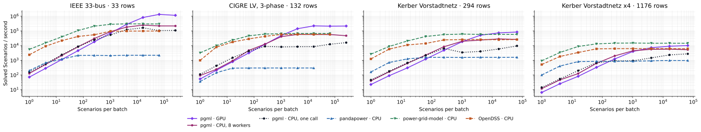
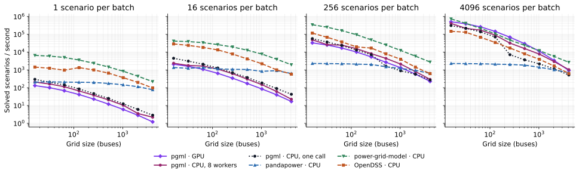
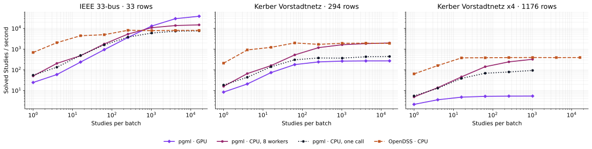
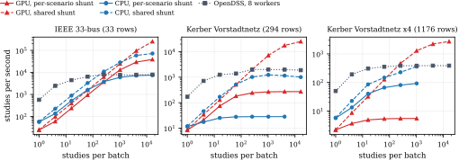
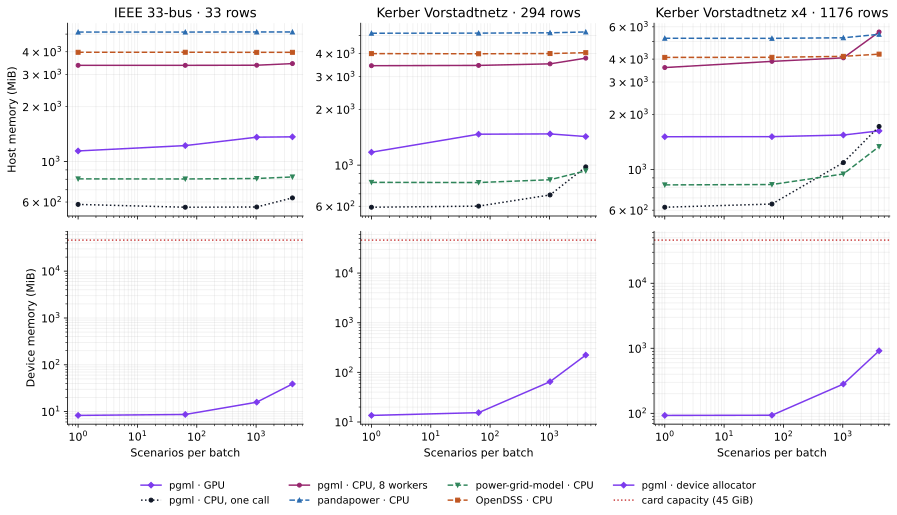
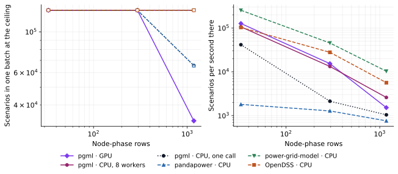
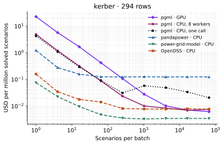
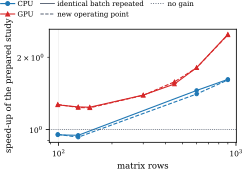
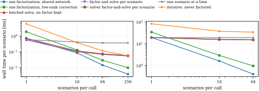
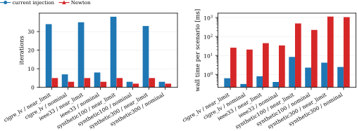

# Performance

How fast pgml solves power flows and harmonic studies compared with pandapower,
power-grid-model and OpenDSS, what it costs in memory and money, and where it loses.
The figures are drawn from recorded results by `run/readme/render.py`, which runs no
experiment. How each number was measured (machines, revisions, tool settings, the
timed region, the validity guard) is in
[PERFORMANCE_RECORD.md](PERFORMANCE_RECORD.md); the full analysis will be in the pgml
paper.

## In short

Speed is not the main reason to use pgml; gradients through the solve are. Where it
does pay off is a specific regime:

- **Many scenarios of a small or medium grid.** One batched call shares its fixed
  cost across the whole batch, so throughput keeps growing with the batch while
  tools that solve one scenario at a time level off. With thousands of scenarios on
  grids of up to a few hundred buses, pgml on one GPU is the fastest and the cheapest
  tool in this comparison.
- **Not a few scenarios.** At a batch of one pgml is more than an order of
  magnitude slower than power-grid-model. A batched solver pays its fixed cost whether the
  batch holds one scenario or a hundred thousand.
- **Not large grids.** From about a thousand node-phase rows, power-grid-model is
  ahead at every batch size measured.
- **Harmonic studies of small grids only.** pgml beats OpenDSS on the 33-bus feeder
  and at best draws level on larger grids.
- **Lean in one process.** One batched pgml call needs far less memory than any tool
  run over a pool of worker processes.

## What is compared, and on what

Each tool solves the same load scenarios of one grid in double precision.
Throughput is the number of scenarios divided by the wall time of one call. Every
measurement gets either one GPU or eight physical CPU cores, never both, and every
CPU tool gets the same eight workers or threads.

| Tool | Hardware | How it is run |
|---|---|---|
| pgml on the GPU | one NVIDIA L40S 48 GB | one batched call |
| pgml on the CPU, 8 workers | 8 physical cores | eight single-threaded worker processes, each one batched call ([why two CPU rows](PERFORMANCE_RECORD.md#the-two-pgml-cpu-configurations)) |
| pgml on the CPU, one call | 8 physical cores | one batched call |
| pandapower | 8 physical cores | one scenario at a time over eight worker processes |
| power-grid-model | 8 physical cores | its native batch calculation on eight threads |
| OpenDSS | 8 physical cores | one scenario at a time over eight worker processes |

A point is shown only if the solution converged and matches a pgml double-precision
reference within 1e-6 pu ([validity guard](PERFORMANCE_RECORD.md#validity-guard)).
Every timed call ends with the voltages in host memory
([what is timed](PERFORMANCE_RECORD.md#what-is-timed)). The grids are the IEEE 33-bus
feeder, the three-phase CIGRE LV benchmark, the 294-bus Kerber network and four merged
copies of it, plus a ladder of synthetic radial feeders from 16 to 4,096 buses
([grids and scenarios](PERFORMANCE_RECORD.md#grids-and-scenarios)). A repeated
measurement on the shared cluster node varies by up to 63 per cent, so a ratio below
1.5 is read as level, not as ahead.

## Batch size

pgml's throughput grows almost in proportion to the batch, because one batched call
shares its fixed cost among all the scenarios in it. The reference tools solve one
scenario at a time and level off once their worker pool is busy. At one scenario per
batch the order is reversed and pgml is last on three of the four grids.

The batch at which the fastest pgml arm overtakes each tool:

| Grid | pandapower | OpenDSS | power-grid-model |
|---|---|---|---|
| IEEE 33, 33 rows | 64 | 4,096 | 16,384 |
| CIGRE LV, 132 rows | 1 to 16 | 4,096 | 4,096 |
| Kerber, 294 rows | 256 | 4,096 | level from 16,384 |
| Kerber x4, 1,176 rows | 256 to 1,024 | 4,096 to 65,536 | never |

A range means the two curves stay within 1.5 times of each other there. The lead over
power-grid-model at the largest batch shrinks with the grid, from four and a half
times on the 33-bus feeder to behind on the 1,176-row network.

pgml on the same eight CPU cores the others get, over eight worker processes, follows
the same shape one level down: it passes pandapower early, OpenDSS only on the 33-bus
feeder, and power-grid-model never.

## Grid size

At a fixed batch, pgml loses speed faster than the reference tools as the grid grows.
On the GPU it factorises a dense matrix; the reference tools use sparse solvers that
exploit the radial structure. At 4,096 scenarios per batch pgml leads OpenDSS and
pandapower on most of the ladder and is level with power-grid-model up to about 1,024
rows, never clearly ahead of it; from 2,048 rows power-grid-model is faster at every
batch size. Why the large grids go this way is
[answered below](#why-do-large-grids-go-the-other-way).

## Harmonic studies

A study is one nonlinear solve at the fundamental plus a linear solve at each of
twelve further odd orders. OpenDSS is the only reference tool with a harmonic power
flow. On the 33-bus feeder pgml overtakes it at about a thousand studies per batch and
ends several times faster. On the two Kerber networks pgml's eight CPU workers at best
draw level with OpenDSS and the GPU stays well below it.

The reason is the model, not the solver. Above the fundamental every load carries a
shunt admittance built from its power, and since a scenario scales every load, every
scenario has its own matrix at every order. Both engines therefore factorise one
matrix per scenario and per order; OpenDSS holds one at a time, pgml holds a chunk of
the batch at once, bounded by `solver.harmonic.system_budget_mb`.

### What the per-scenario matrix costs

`load_shunt_basis="nameplate"` builds the shunt from each device's stored power and
ignores the scenario, so one matrix per order serves the whole batch and one
factorisation answers all of it. It is up to several hundred times faster on the GPU,
but it is a different model from the one OpenDSS solves: on the 33-bus feeder it falls
outside the 1e-4 pu acceptance band against OpenDSS that the matched model meets. The default,
per-scenario basis is the one in the harmonic figure above.

An exact low-rank shortcut exists in the solver but does not apply here: a
distribution feeder carries a load on almost every bus, and at that many changed rows
a correction costs more than a fresh factorisation.

### Sparse harmonic assembly on the CPU

On the CPU sparse backend pgml assembles the harmonic matrices as their nonzero
entries and never forms the dense `[B, H, N, N]` tensor. The solved voltages are
bit-identical to the dense route. This is first a memory change: on the 1,176-row
network one study at 256 per batch needs about eleven times less host memory than
before. It also runs the CPU sparse arms several times faster on the workstation it was
measured on. The GPU and the dense backend are unchanged by it.

## Memory

- **A worker pool costs 3.5 to 5.6 GB before it solves anything,** because eight
  interpreters each hold their own copy of the library and the grid. That cost barely
  moves with the grid or the batch, so it dominates every small job.
- **A single process is far leaner.** One batched pgml call and power-grid-model's
  threaded batch both stay under 2 GB at every point measured. A container too small
  to start pandapower's pool can still run pgml on the same grid with room for many
  thousands of scenarios.
- **pgml pays per scenario instead.** It keeps every scenario of the batch in flight,
  so it adds about twice as much memory per scenario as power-grid-model. On the
  largest grid a single pgml process becomes heavier than power-grid-model at a few
  hundred scenarios per batch.

On the device the matrix and its factorisation do not depend on the batch; what grows
is everything the iteration carries per scenario. On a 48 GB card the 1,176-row
network fits 131,072 scenarios in one batch, and the two smaller grids reached the
search cap of 262,144 without running out.

## Filling the machine with scenarios

How many scenarios a machine holds at once, and how fast they are solved when it is
full, measured on one workstation with a 12 GB RTX A2000. Memory is rarely what stops
a tool: almost every arm reached the batch cap or its time limit first. At capacity
power-grid-model is first on every grid here, which differs from the L40S figures
because a workstation card has a fraction of an L40S's double-precision throughput.
Which tool wins therefore depends on the accelerator at least as much as on the batch.

## Cost

Throughput converted into money at published on-demand list prices
([prices](PERFORMANCE_RECORD.md#section-specific-conditions)). This is a price model,
not a measurement. The GPU instance costs 2.6 times the CPU instance, so a GPU
speed-up below 2.6 times is not a saving. At its fastest batch pgml on the GPU is the
cheapest tool on the 33-bus feeder and on CIGRE LV; on the 294-row network
power-grid-model is. pandapower is the most expensive tool on every grid by a wide
margin.

## Frequently asked questions (FAQ)

### Why is pgml slow for a few scenarios?

A batched call does fixed work regardless of the batch size: assembling and
factorising the admittance and launching every tensor operation of the iteration. A per-scenario engine has
almost no such overhead. pgml recovers it only when the batch is large enough to share
it, which is why every pgml curve starts low and climbs.

### Why do large grids go the other way?

Measured on a workstation, the factorisation is not the problem. Above 512 rows pgml's
CPU path factorises sparsely with a fill-reducing ordering that stays within six per
cent of the zero-fill optimum on a radial feeder, once per solve.

What costs is the work repeated for every scenario in every iteration: the
back-substitutions take about half the wall time, the device-current evaluation and
the convergence test most of the rest. On the CPU, handing a batch of right-hand sides
to SuperLU also copies them between memory layouts, 30 to 40 per cent of that call. On
the GPU the factorisation is dense, so one scenario's back-substitution costs the
square of the row count where a sparse one costs a small multiple of it, and a batch
does not amortise that.

What would narrow it, in order of worth: a batched sparse triangular solve on the
device (which torch does not provide today), one array layout around SuperLU, fused
per-iteration passes, and keeping the factorisation across calls for callers that
solve the same grid repeatedly at small batches.

### What do the solver's own options change?

A prepared harmonic system (`HarmonicFlowSystem` passed as `system=`) keeps the
network matrices and factorisations that do not depend on the operating point. It pays
on a GPU at every size measured and on a CPU from a few hundred rows, and the gain
grows with the grid.

On the linear algebra itself, what pays is reuse: one factorisation of a shared
network answers a batch tens of times faster than one factorisation per scenario, and
an exact low-rank (Woodbury) correction to a shared factorisation still gains more
than tenfold where the per-scenario change is structured. Solving scenarios one at a time instead of batching costs several times over.

The current-injection fixed point and Newton converge to the same solution and carry
the same gradient. Newton takes fewer iterations but is much slower per solve, because
every step rebuilds and factorises the state Jacobian and a batch is solved one
scenario at a time. The fixed point is the default for batches; Newton is for stiff
cases near the loadability limit.

### How fair is the comparison?

Every tool gets the same allocation, the same scenarios, a warm-up and five timed
repetitions, and a correctness check on every plotted point. The remaining
differences (worker hand-over costs for the pooled tools, a looser harmonic
tolerance against OpenDSS, zero-sequence fills on CIGRE LV, pgml rebuilding its
matrix in every call) are listed in [what is still not identical](PERFORMANCE_RECORD.md#what-is-still-not-identical).
